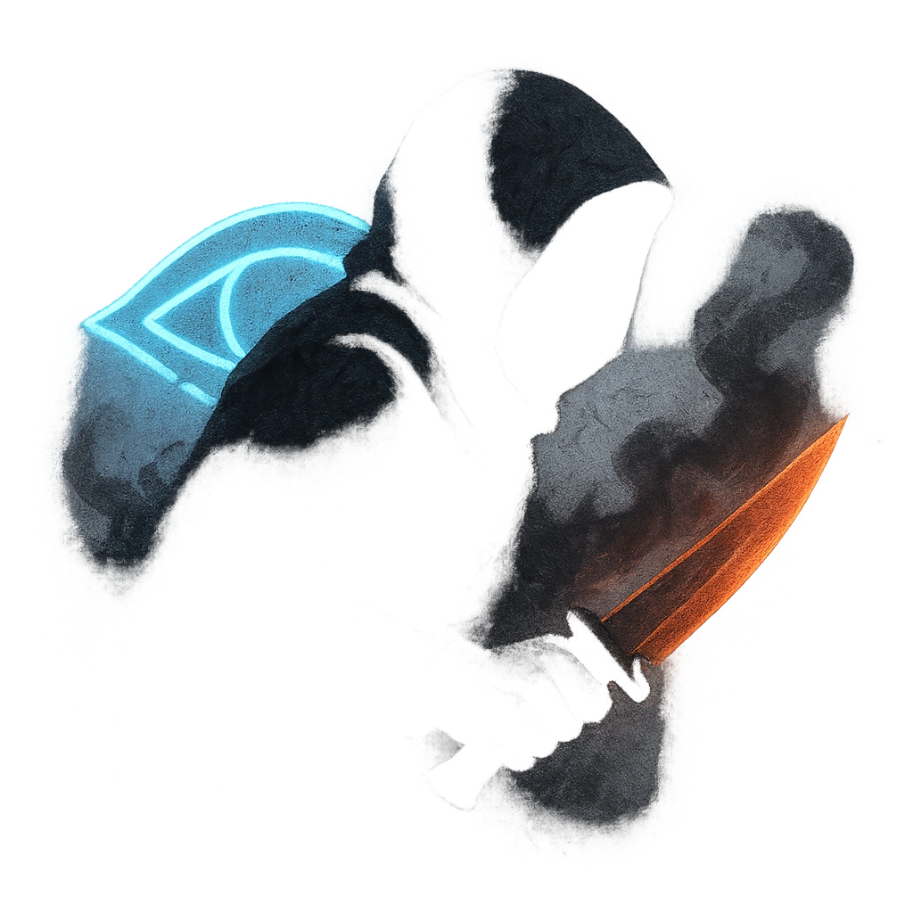

# Unseen Strike

## Description
*
If the Sniper is <em>Hidden</em> when they make a successful standard attack against a target, they deal <strong>1d10+4</strong> physical damage instead of their standard damage.
*

## Actions
- 
**Attack** *If the Sniper is Hidden when they make a successful standard attack against a target, they deal 1d10+4 physical damage instead of their standard damage.*

---

adversaries-features/Standard
 
**UUID:** `Compendium.cybermancy.system.unseen-strike`

