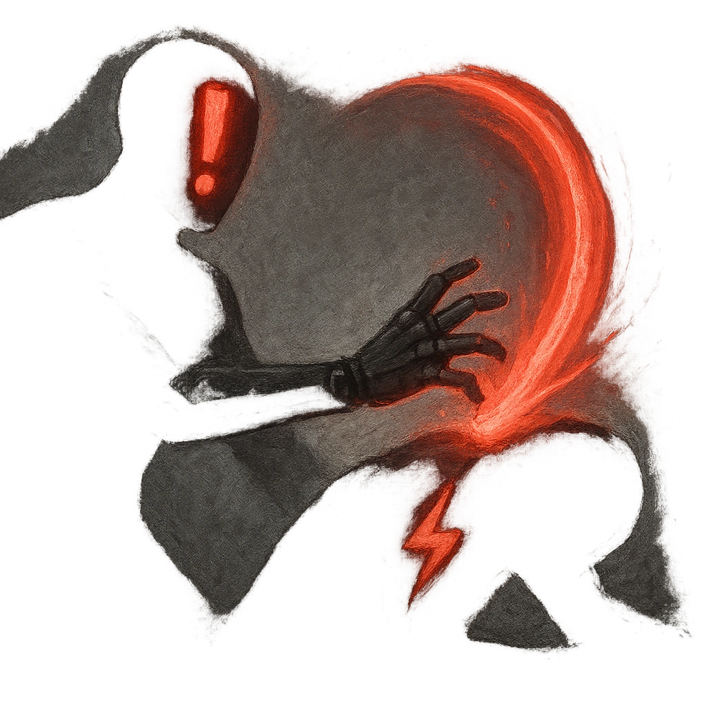

# Vengeful Fate

## Description
*
When the Oracle marks HP from an attack within Very Close range, you can <strong>mark a Stress</strong> to knock the attacker back to Far range and deal <strong>2d10+4</strong> physical damage.
*

## Actions
- 
**Damage** *When the Oracle marks HP from an attack within Very Close range, you can mark a Stress to knock the attacker back to Far range and deal 2d10+4 physical damage.*

---

adversaries-features/Solo
 
**UUID:** `Compendium.cybermancy.system.vengeful-fate`

