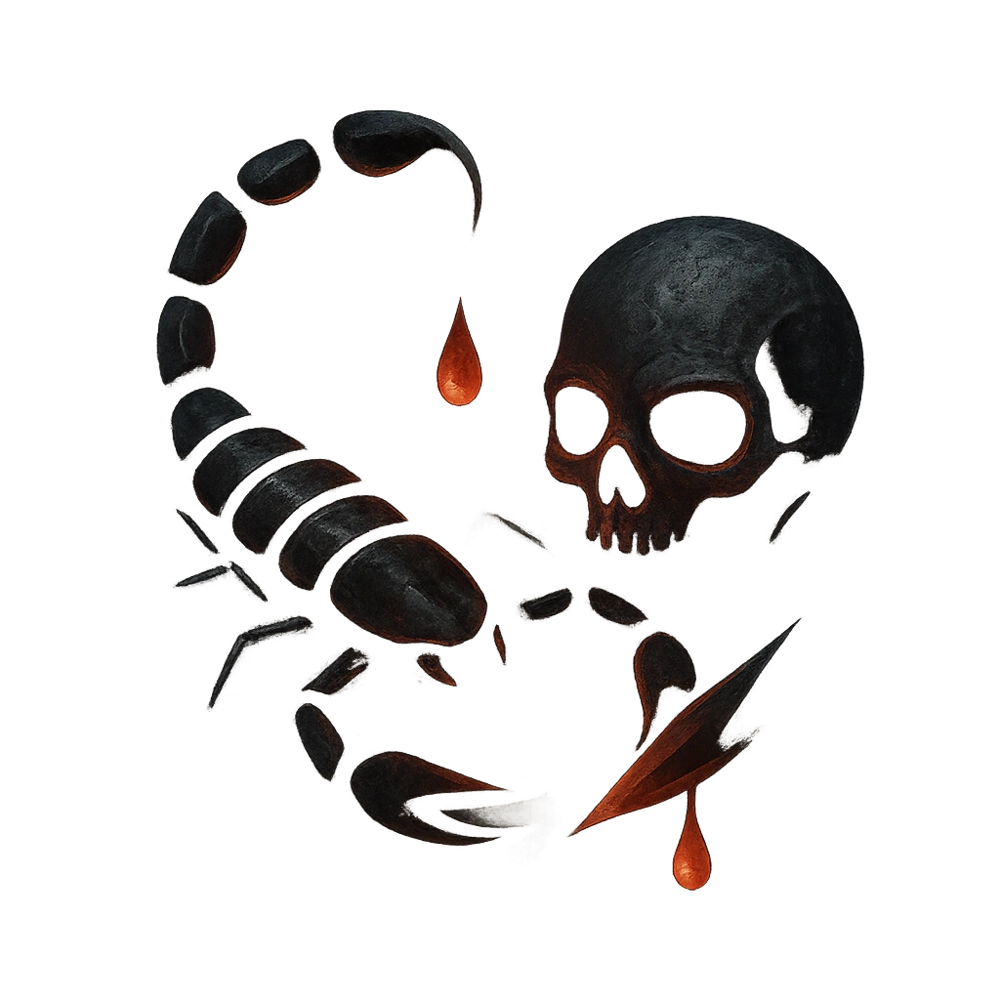

# Venomous Stinger

## Description
*
Make an attack against a target within Very Close range. On a success, <strong>spend a Fear</strong> to deal <strong>1d4+4</strong> physical damage and Poison them until their next rest or they succeed on a Knowledge Roll (16). While Poisoned, the target must roll a <strong>d6</strong> before they make an action roll. On a result of 4 or lower, they must mark a Stress. 
*

## Actions
- 
**Attack** *Make an attack against a target within Very Close range. On a success, spend a Fear to deal 1d4+4 physical damage and Poison them until their next rest or they succeed on a Knowledge Roll (16). While Poisoned, the target must roll a d6 before they make an action roll. On a result of 4 or lower, they must mark a Stress.*

---

adversaries-features/Bruiser
 
**UUID:** `Compendium.cybermancy.system.venomous-stinger`

