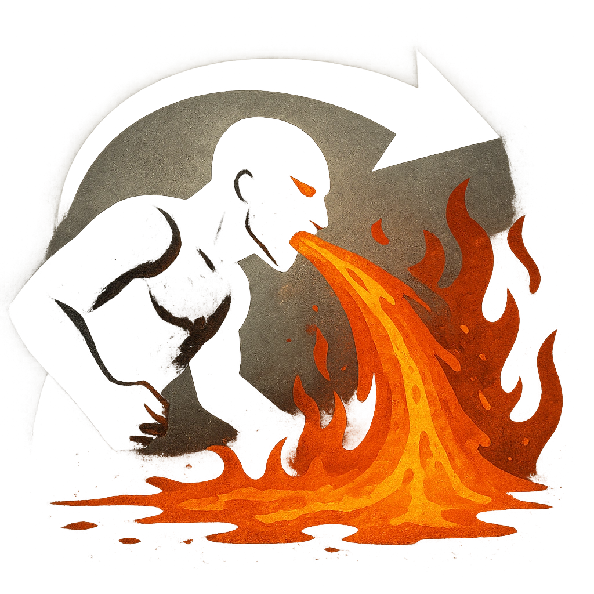

# Volcanic Breath

## Description
*
When the Molten Scourge takes Major damage, roll a <strong>d10</strong>. On a result of 8 or higher, the Molten Scourge breathes a flow of lava in front of them within Far range. All targets in that area must make an Agility Reaction Roll. Targets who fail take <strong>2d10+4</strong> physical damage, mark <strong>1d4</strong> Stress, and are Vulnerable until they clear a Stress. Targets who succeed take half damage and must mark a Stress.

@Template[type:inFront|range:f]
*

## Actions
- 
**Roll d10** *When the Molten Scourge takes Major damage, roll a d10. On a result of 8 or higher, the Molten Scourge breathes a flow of lava in front of them within Far range.*

- 
**Roll Save** *f]*

---

adversaries-features/Solo
 
**UUID:** `Compendium.cybermancy.system.volcanic-breath`

