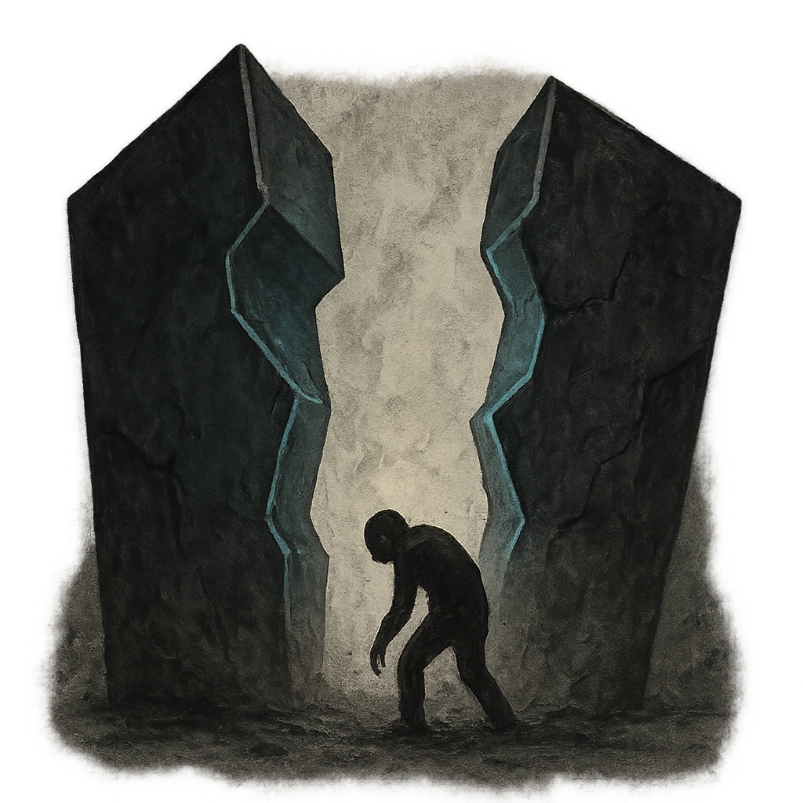

# Walls Closing In

## Description
*
When a creature rolls a failure while within Very Far range of the Oracle, they must mark a Stress.
*

## Actions
- 
**Mark Stress** *When a creature rolls a failure while within Very Far range of the Oracle, they must mark a Stress.*

---

adversaries-features/Solo
 
**UUID:** `Compendium.cybermancy.system.walls-closing-in`

