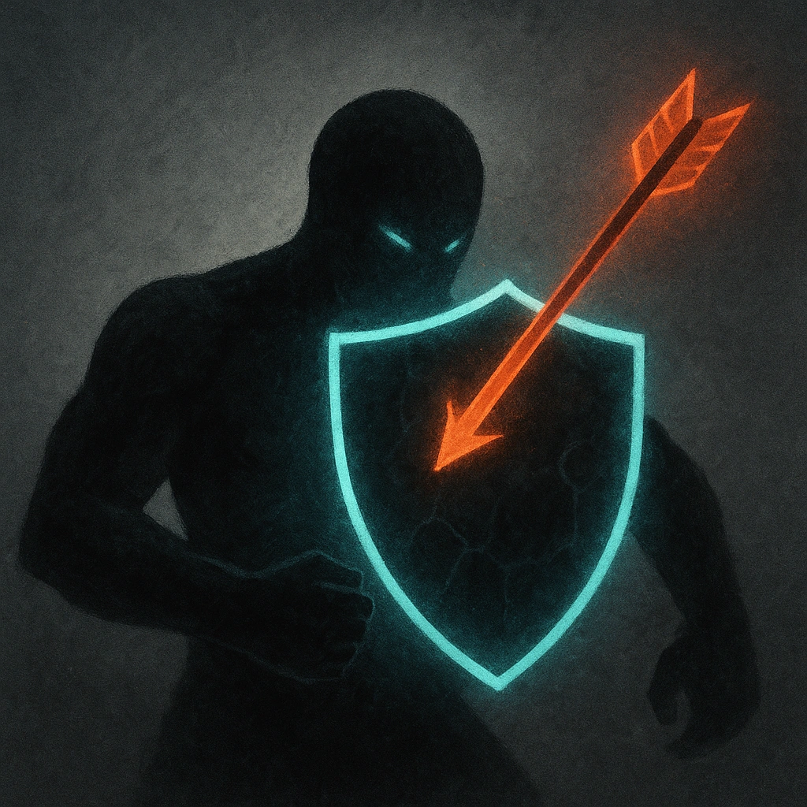

# Warped Fortitude

## Description
*
The Experiment is resistant to physical damage.
*

## Actions
—

---

adversaries-features/Standard
 
**UUID:** `Compendium.cybermancy.system.warped-fortitude`

