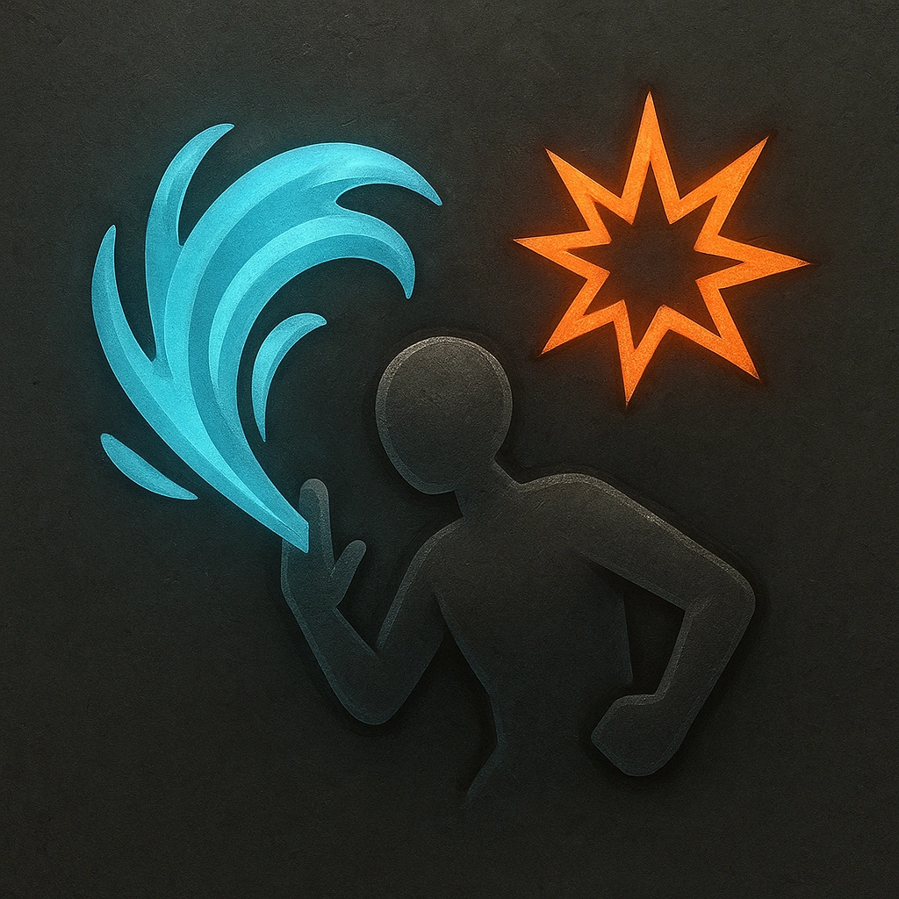

# Water Jet

## Description
*
<strong>Mark a Stress</strong> to attack a target within Very Close range. On a success, deal <strong>2d4+7</strong> physical damage and the target’s next action has disadvantage. On a failure, the target must mark a Stress.
*

## Actions
- 
**Attack** *Mark a Stress to attack a target within Very Close range. On a success, deal 2d4+7 physical damage and the target’s next action has disadvantage. On a failure, the target must mark a Stress.*

---

adversaries-features/Support
 
**UUID:** `Compendium.cybermancy.system.water-jet`

