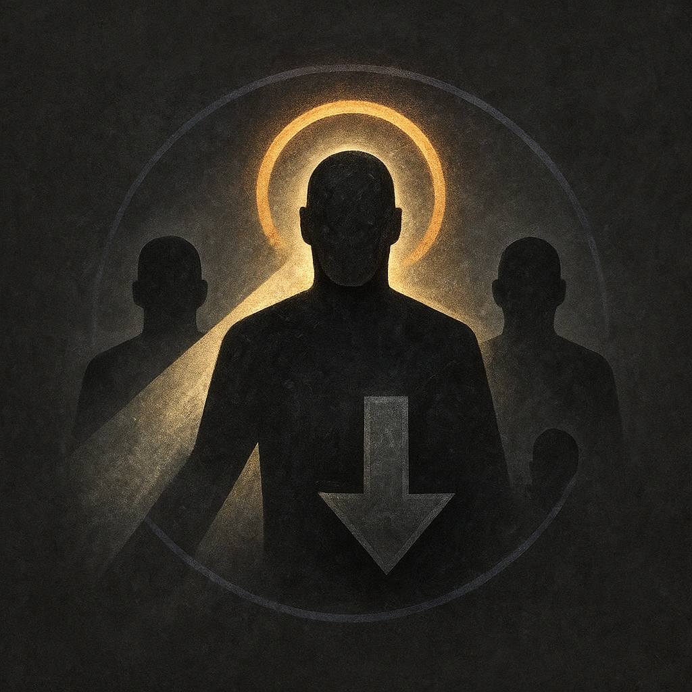

# We Are One

## Description
*
Once per scene, <strong>spend a Fear</strong> to spotlight all other adversaries within Far range. Attacks they make while spotlighted in this way deal half damage.
*

## Actions
- 
**Spend Fear** *Once per scene, spend a Fear to spotlight all other adversaries within Far range. Attacks they make while spotlighted in this way deal half damage.*

---

adversaries-features/Leader
 
**UUID:** `Compendium.cybermancy.system.we-are-one`

