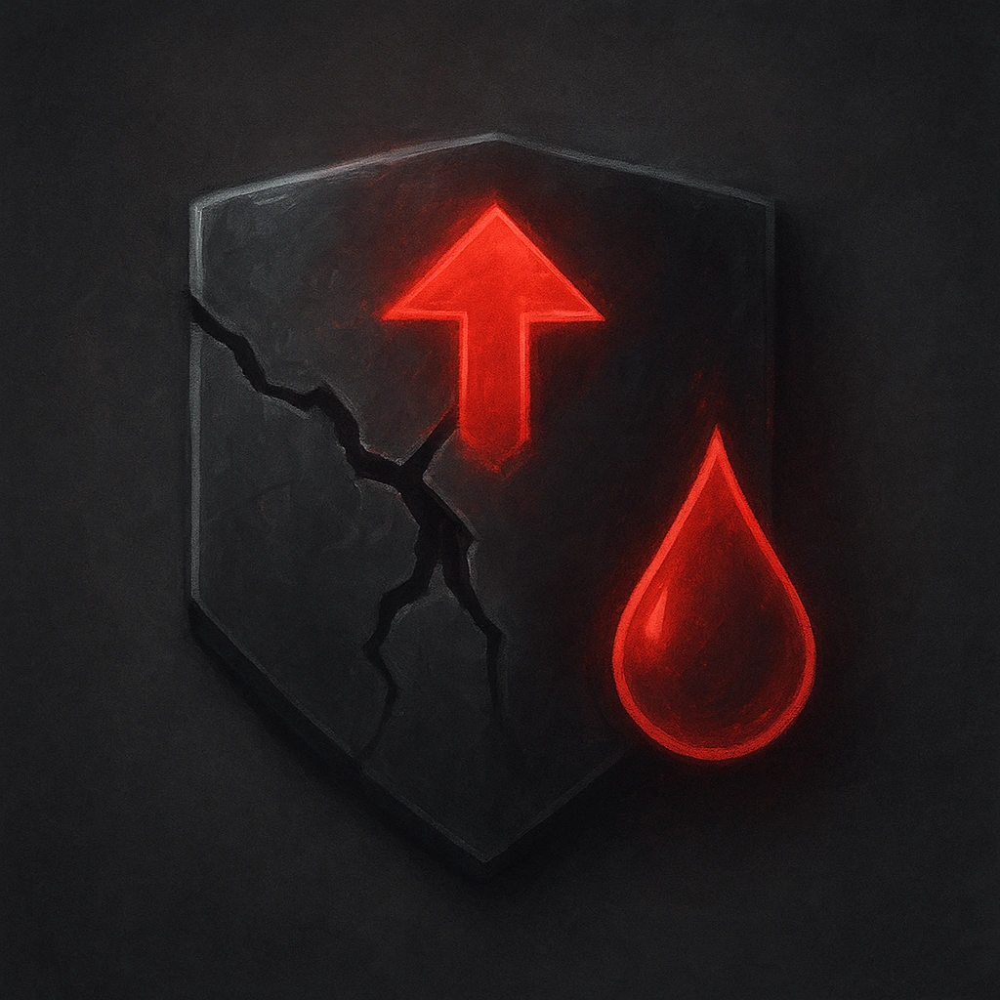

# Weak Structure

## Description
*
When the Construct marks HP from physical damage, they must mark an additional HP.
*

## Actions
—

---

adversaries-features/Solo
 
**UUID:** `Compendium.cybermancy.system.weak-structure`

