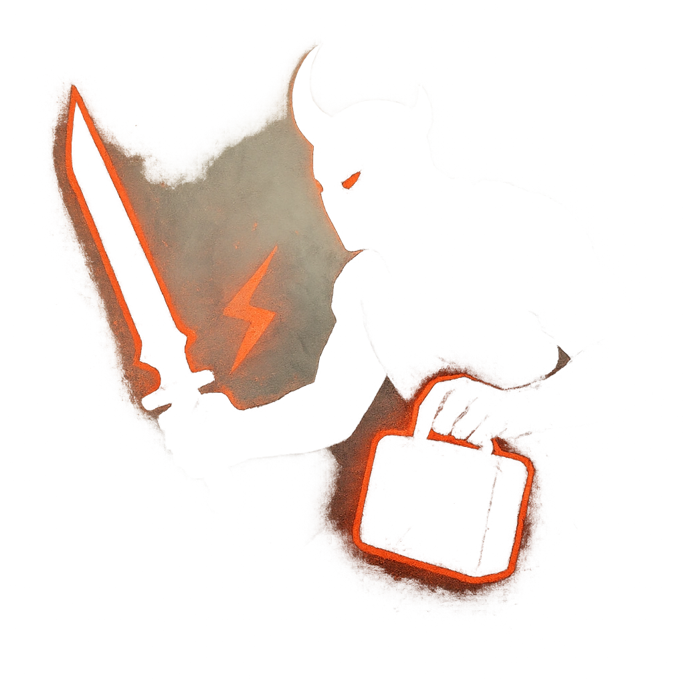

# What's Yours Is Mine

## Description
*
When a PC takes Severe damage within Very Close range of the Demon, you can <strong>spend a Fear</strong> to cause the target to make a Finesse Reaction Roll. On a failure, the Demon seizes one item or consumable of their choice from the target’s inventory.

@Template[type:emanation|range:vc]
*

## Actions
- 
**Roll Save** *vc]*

---

adversaries-features/Ranged
 
**UUID:** `Compendium.cybermancy.system.what-s-yours-is-mine`

