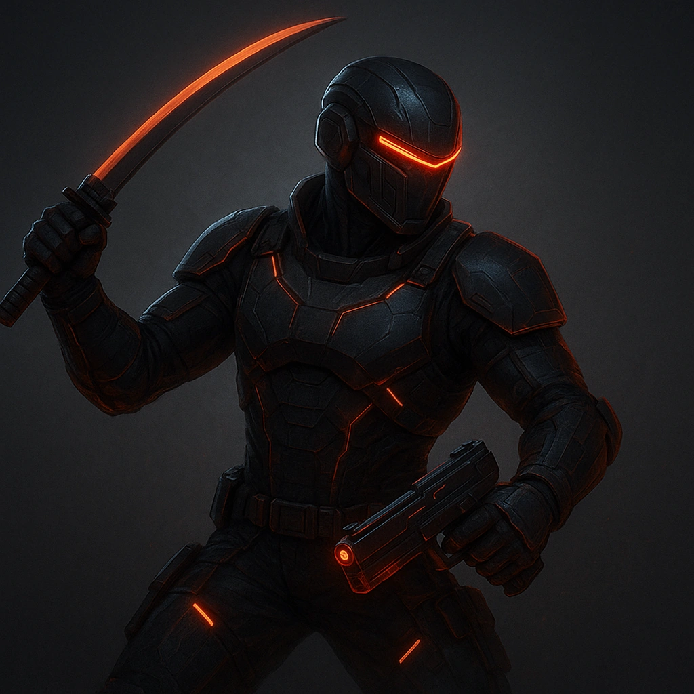

# Whirlwind

## Description
*
<strong>Spend a Fear</strong> to whirl, making an attack against all targets within Very Close range. Targets the Flickerfly succeeds against take <strong>3d8</strong> direct physical damage.

@Template[type:emanation|range:vc]
*

## Actions
- 
**Attack** *vc]*

---

adversaries-features/Solo
 
**UUID:** `Compendium.cybermancy.system.whirlwind`

