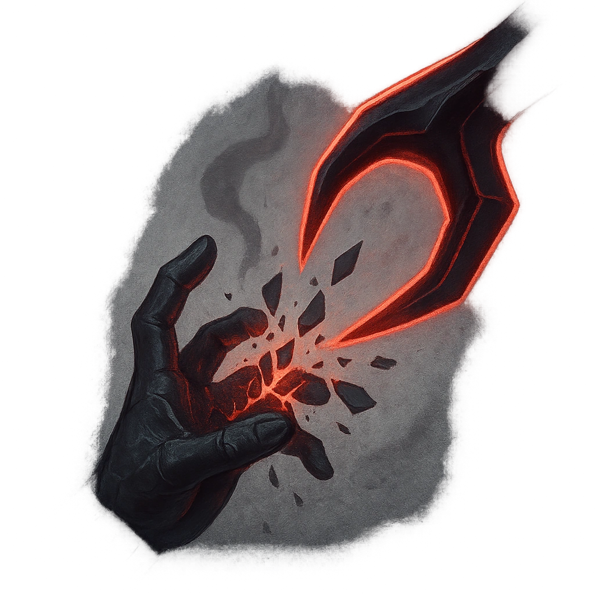

# Will-Shattering Touch

## Description
*
When a PC takes damage from the Corrupter, they lose a Hope.
*

## Actions
- 
**Lose Hope** *When a PC takes damage from the Corrupter, they lose a Hope.*

---

adversaries-features/Support
 
**UUID:** `Compendium.cybermancy.system.will-shattering-touch`

