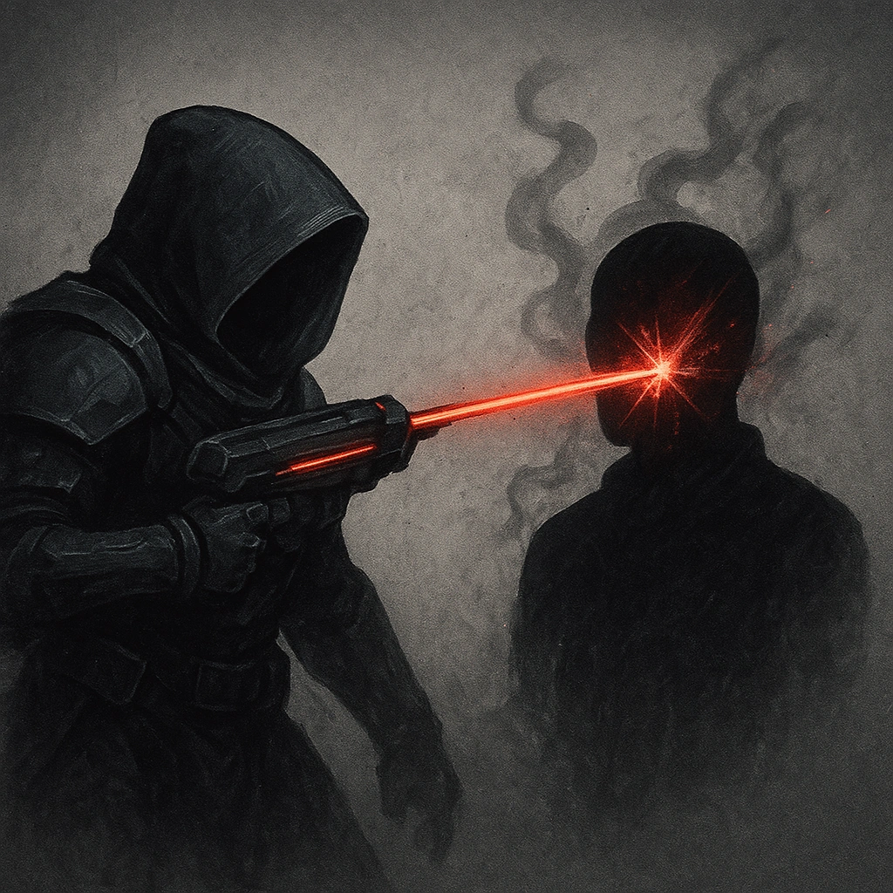

# Won't See it Coming

## Description
*
 The Assassin deals direct damage while they’re <em>Hidden</em>.
*

## Actions
—

---

adversaries-features/Leader
 
**UUID:** `Compendium.cybermancy.system.won-t-see-it-coming`

