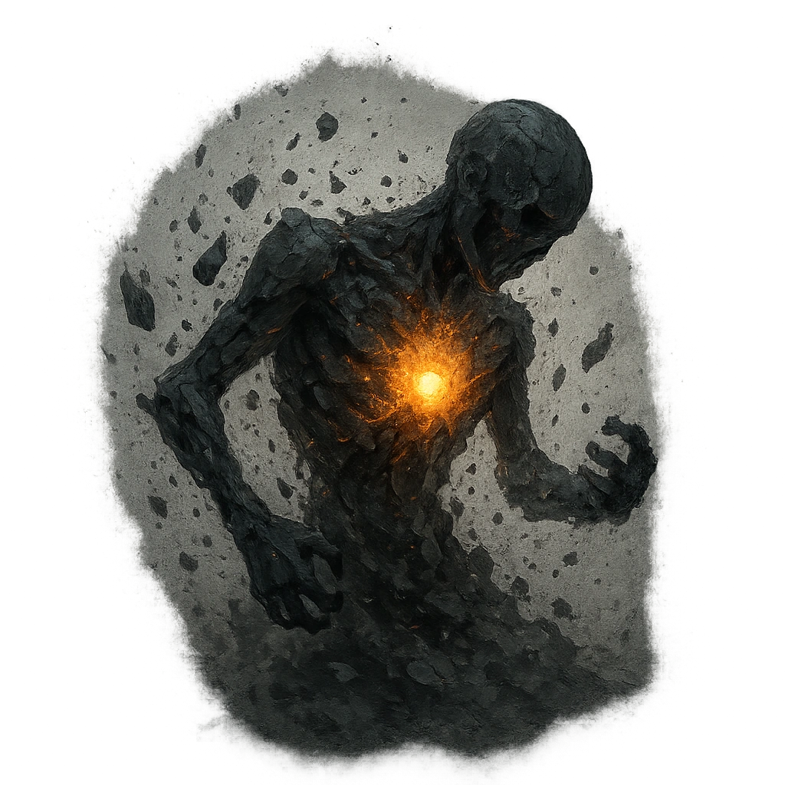

# Won't Stay Dead

## Description
*
When the Warrior is defeated, you can spotlight them and roll a <strong>d6</strong>. On a result of 6, if there are other adversaries on the battlefi eld, the Warrior re-forms with no marked HP.
*

## Actions
- 
**Use** *When the Warrior is defeated, you can spotlight them and roll a d6. On a result of 6, if there are other adversaries on the battlefi eld, the Warrior re-forms with no marked HP.*

---

adversaries-features/Standard
 
**UUID:** `Compendium.cybermancy.system.won-t-stay-dead`

