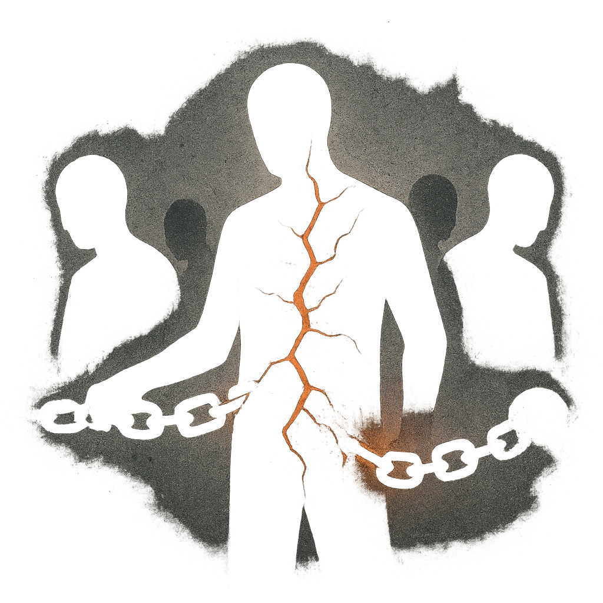

# Your Friends Will Fail You

## Description
*
When a PC fails with Fear, you can <strong>mark a Stress</strong> to cause all other PCs within Close range to lose a Hope.

@Template[type:emanation|range:c]
*

## Actions
- 
**Lose Hope** *c]*

---

adversaries-features/Skulk
 
**UUID:** `Compendium.cybermancy.system.your-friends-will-fail-you`

