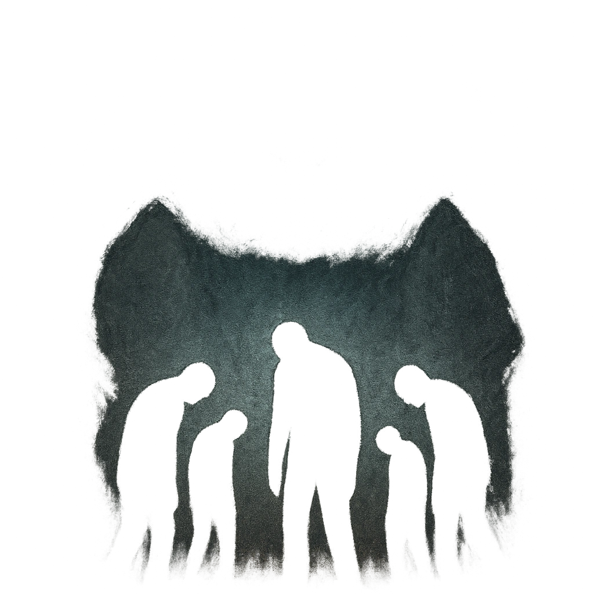

# Your Struggle is Pointless

## Description
*
<strong>Spend a Fear</strong> to weigh down the spirits of all PCs within Far range. All targets affected replace their Hope Die with a <strong>d8</strong> until they roll a success with Hope or their next rest.

@Template[type:emanation|range:f]
*

## Actions
- 
**Spend Fear** *f]*

---

adversaries-features/Skulk
 
**UUID:** `Compendium.cybermancy.system.your-struggle-is-pointless`

