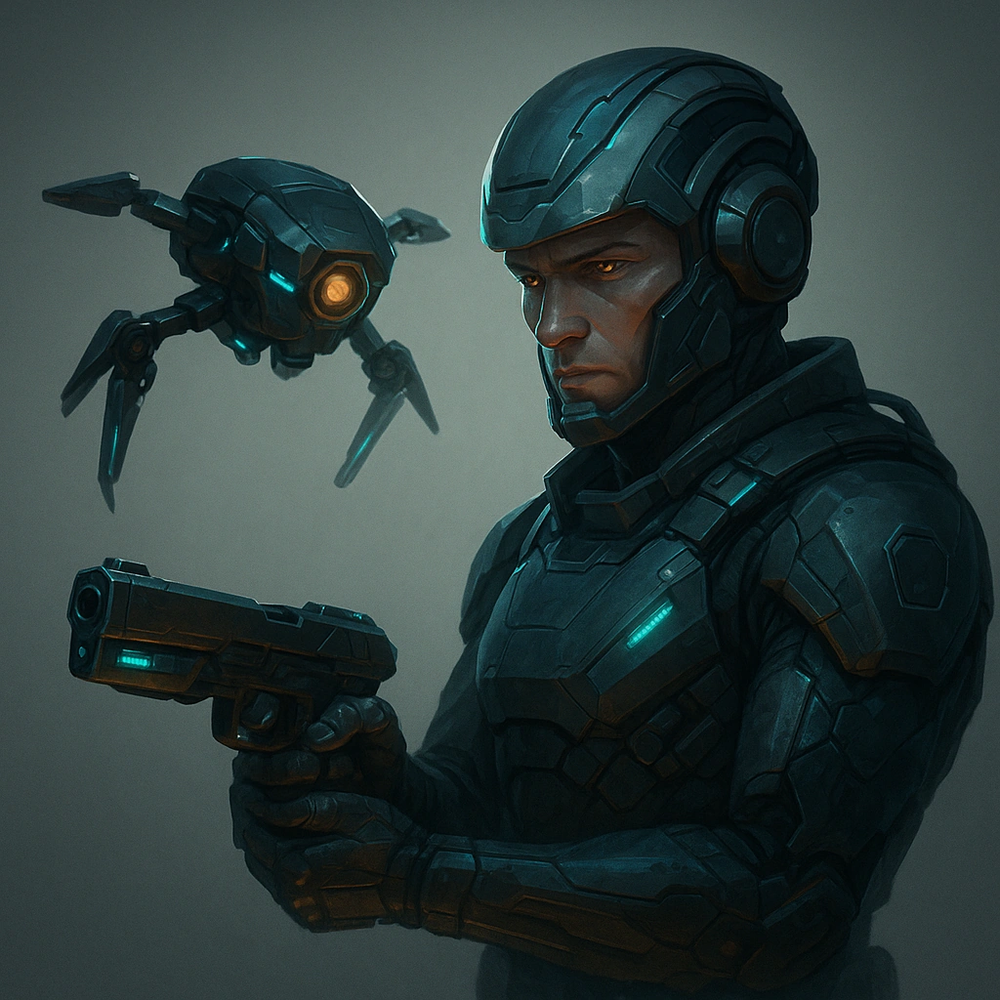

# Lethal Combo

Feature • Common

  
  

## Effect

---

## Description
&lt;p class="Card-Feature"&gt;&lt;strong&gt;Mark 1 Stress&lt;/strong&gt;Mark 1 Stress for you and your Primary Drone both to take an action during a Spotlight&lt;/p&gt;

**Source:** *(fill in)* • **UUID:** `Compendium.cybermancy.system.lethal-combo`

