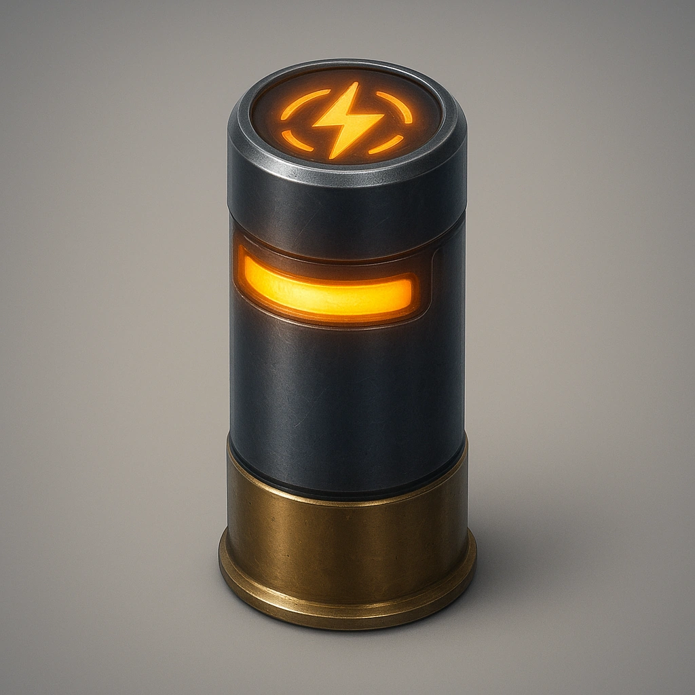

# EMP Shells

*
Take a <strong>Reload action</strong> to apply this ammo to a <strong>shotgun</strong> (only shotgun compatible) and place 3 tokens on this card.   Each subsequent attacks using that weapon create an EMP affect on the targeted drone or electronic construct, doing 2d8+3 extra physical damage.
*

### **Tier: —**

#### Actions
- 
**EMP Shells** *Take a Reload action to apply this ammo to a shotgun (only shotgun compatible) and place 2 tokens on this card. 

 All subsequent attacks using that weapon create an EMP affect on the targeted drone or electronic construct, doing 2d8+3 physical damage.*

#### Effects
—

ammo
 
**UUID:** `Compendium.cybermancy.ammo.emp-shells`

