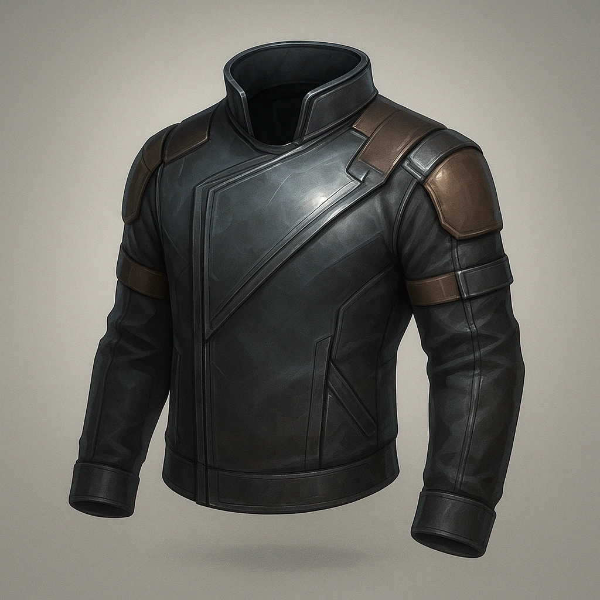

### Advanced Slash-Resistant Jacket

*Polymer-link weave with ceramic micro-scales; shrugs off knives and claws.*

#### Stats
<table class="stat-table">
  <thead><tr><th>Attribute</th><th>Value</th></tr></thead>
  <tbody>
    <tr><td>Tier</td><td align="right">2</td></tr>
    <tr><td>Base Score</td><td align="right">5</td></tr>
    <tr><td>Thresholds</td><td align="right">11 / 24</td></tr>
  </tbody>
</table>

#### Actions
—

#### Effects
- 
**Heavy** *-1 to Evasion*

#### Armor Features
- 
**Heavy** *None*

---

**UUID:** `Compendium.cybermancy.armors.advanced-slash-resistant-jacket`

