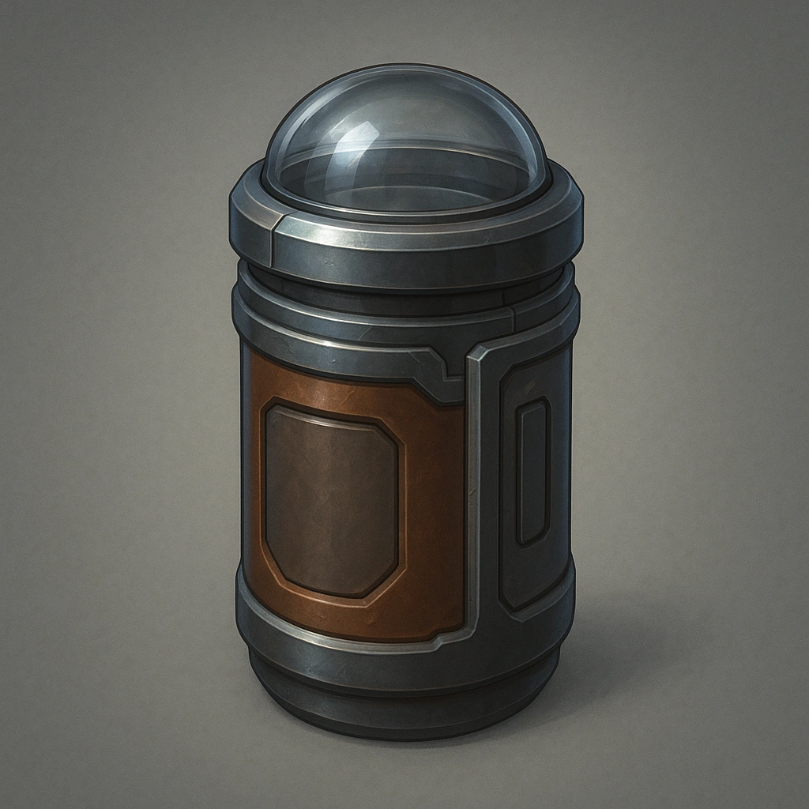

    

    

    

    ### Auto-Heal Laminate

    

    *Self-tightening fibers that cinch when stressed, buying you precious seconds before a breach.*
    

    

    

    #### Stats
    <table class="stat-table">
      <thead><tr><th>Attribute</th><th>Value</th></tr></thead>
      <tbody>
        <tr><td>Base Score</td><td>4</td></tr>
        <tr><td>Thresholds</td><td>{'major': 9, 'severe': 21}</td></tr>
      </tbody>
    </table>

    #### Actions
    —

    #### Effects
    —

    #### Armor Features
    - Unnamed Feature [armor-feature]

    

    

    ---

    

    **UUID:** `Compendium.cybermancy.armors.auto-heal-laminate`
    

    

    