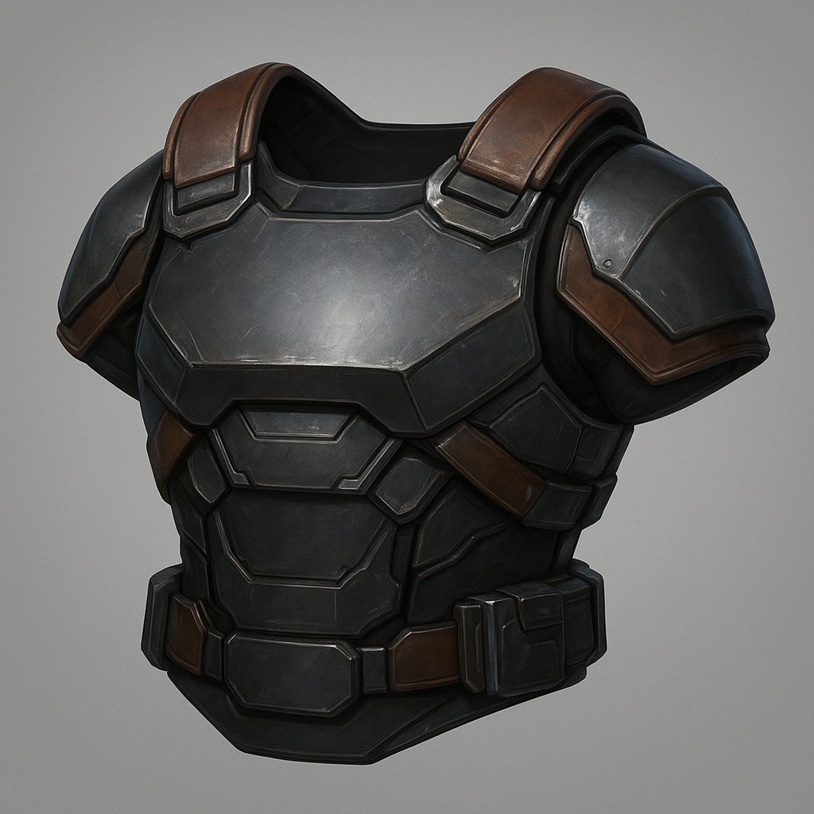

# Enhanced Riot Carapace

*Optimized riot carapace with servo assists at the knees and shoulders—still heavy, now meaner.*

#### Stats
<table class="stat-table">
  <thead><tr><th>Attribute</th><th>Value</th></tr></thead>
  <tbody>
    <tr><td>Tier</td><td align="right">2</td></tr>
    <tr><td>Base Score</td><td align="right">5</td></tr>
    <tr><td>Thresholds</td><td align="right">13 / 28</td></tr>
  </tbody>
</table>

#### Actions
—

#### Effects
- 
**Very Heavy** *-2 to Evasion; -1 to Agility*

#### Armor Features
- 
**Veryheavy** *None*

---

armors/Tier 2
 
**UUID:** `Compendium.cybermancy.armors.enhanced-riot-carapace`

