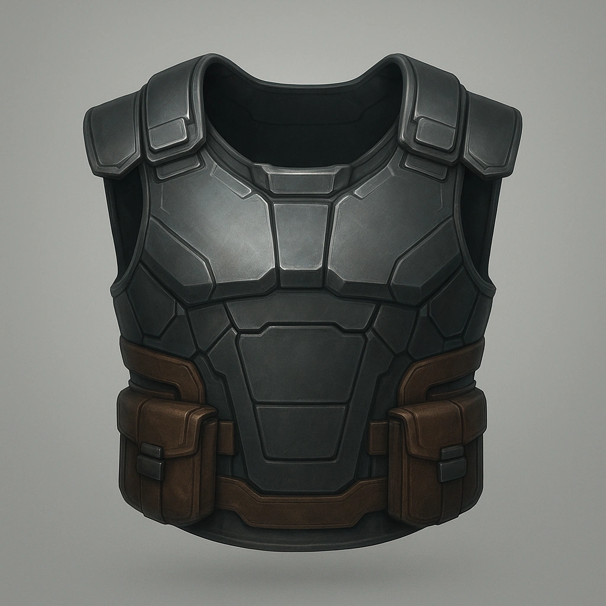

### Reinforced Street Vest

Armor • Common • —

**

  Armors
  
  
  

#### Stats
<table class="stat-table">
  <thead><tr><th>Attribute</th><th>Value</th></tr></thead>
  <tbody>
    <tr><td>Category</td><td>Armors</td></tr>
    <tr><td>Damage</td><td>—</td></tr>
    <tr><td>Range</td><td>—</td></tr>
    <tr><td>Hands</td><td>—</td></tr>
    <tr><td>Reload/Charges</td><td>—</td></tr>
    <tr><td>Requirements</td><td>—</td></tr>
  </tbody>
</table>

#### Effects
- *(Map rules/effects here if provided in JSON.)*

#### Usage
- *(Notes on reload/drawbacks/synergies.)*

---

#### Description
Up-armored padding with denser gels and better dispersion. Looks cheap, works miracles.

**Source:** *(fill in)* • **UUID:** `Compendium.cybermancy.armors.reinforced-street-vest`

