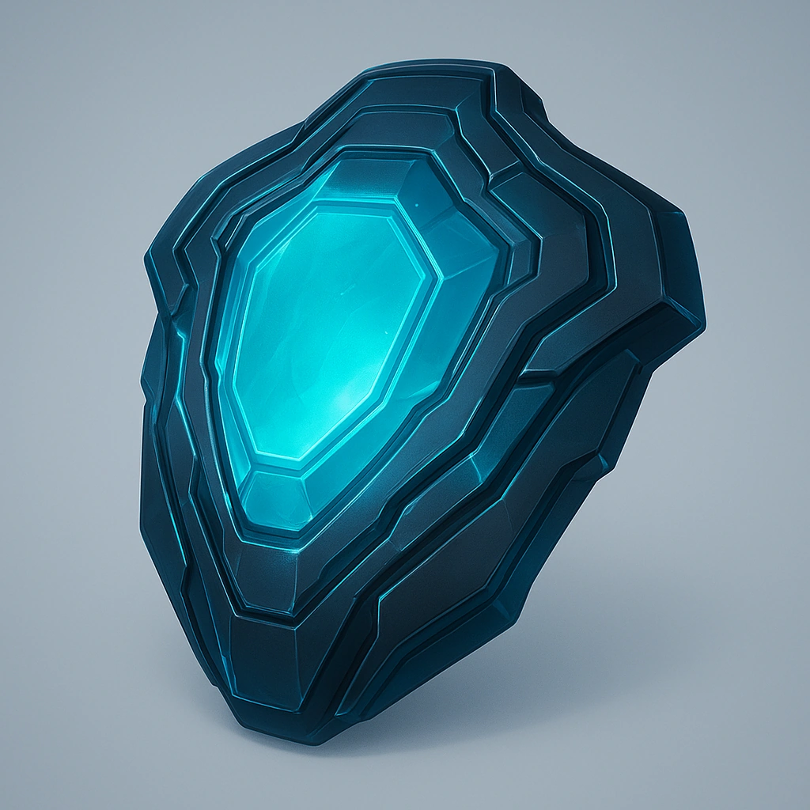

### Truthlight Carapace

*Embedded truth-sensors flare when lies hit the air—corp meetings just got interesting.*

#### Stats
<table class="stat-table">
  <thead><tr><th>Attribute</th><th>Value</th></tr></thead>
  <tbody>
    <tr><td>Tier</td><td align="right">4</td></tr>
    <tr><td>Base Score</td><td align="right">6</td></tr>
    <tr><td>Thresholds</td><td align="right">13 / 36</td></tr>
  </tbody>
</table>

#### Actions
- 
**Truthseeking** *This armor glows when another creature within Close range tells a lie.*

#### Effects
—

#### Armor Features
- 
**Truthseeking** *None*

---

**UUID:** `Compendium.cybermancy.armors.truthlight-carapace`

