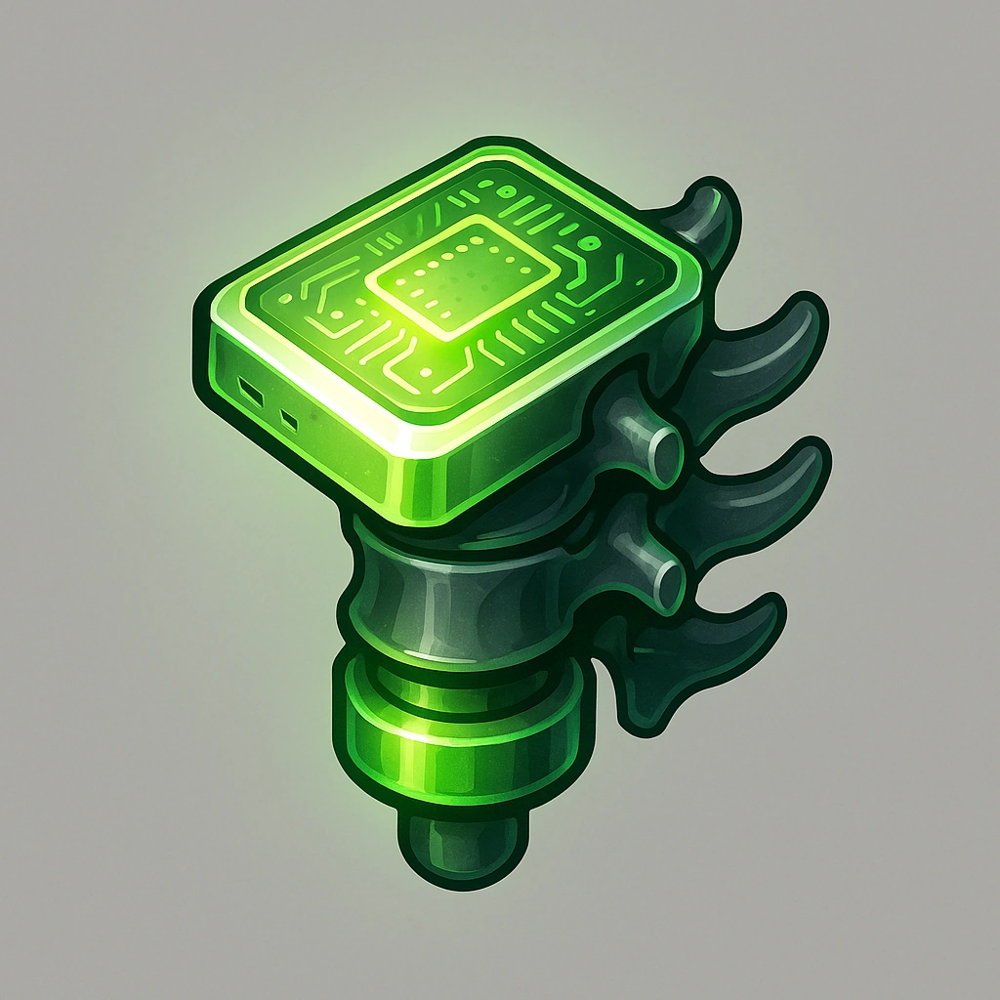

# Grav-Damp Chip

*A spinal implant chip that reduces gravitational pull, letting you fall slowly for minutes equal to your level.*

### **Tier: —**

#### Actions
- 
**Use** *You can use this bone to control your falling speed for a number of minutes equal to your level.*

#### Effects
—

consumables
 
**UUID:** `Compendium.cybermancy.consumables.grav-damp-chip`

