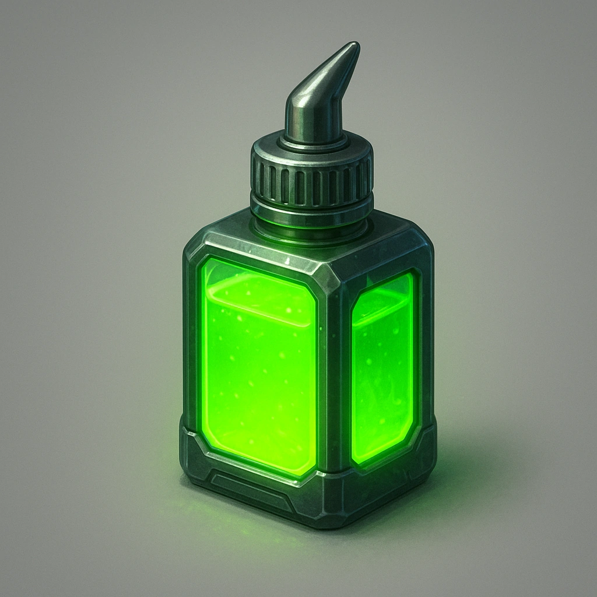

# Industrial Adhesive Gel

*A dual-compound resin that permanently bonds objects together.*

### **Tier: —**

#### Actions
- 
**Use** *This honey can be used to glue two objects together permanently.*

#### Effects
—

consumables
 
**UUID:** `Compendium.cybermancy.consumables.industrial-adhesive-gel`

