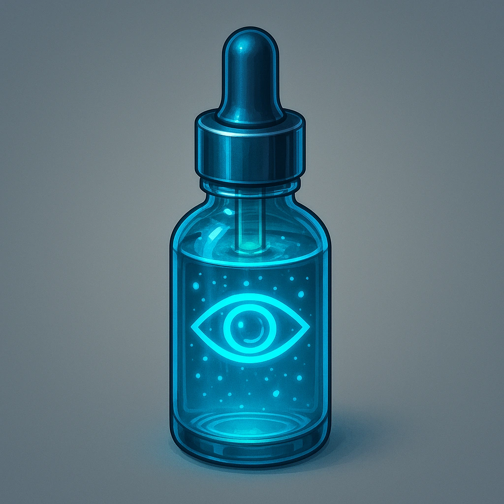

# Night-Vision Eye Drops

*A retinal nanofluid that enhances low-light sensitivity. You can see in total darkness until your next rest.*

### **Tier: Tier 2**

#### Actions
- 
**Drink** *When you drink the contents of this vial, you can see in total darkness until your next rest.*

#### Effects
- 
**Vial of Moondrip** *
<span style="color:rgb(239, 230, 216);font-family:Montserrat, sans-serif;font-size:14px;font-style:normal;font-variant-ligatures:normal;font-variant-caps:normal;font-weight:4…*

consumables/Tier 2
 
**UUID:** `Compendium.cybermancy.consumables.night-vision-eye-drops`

