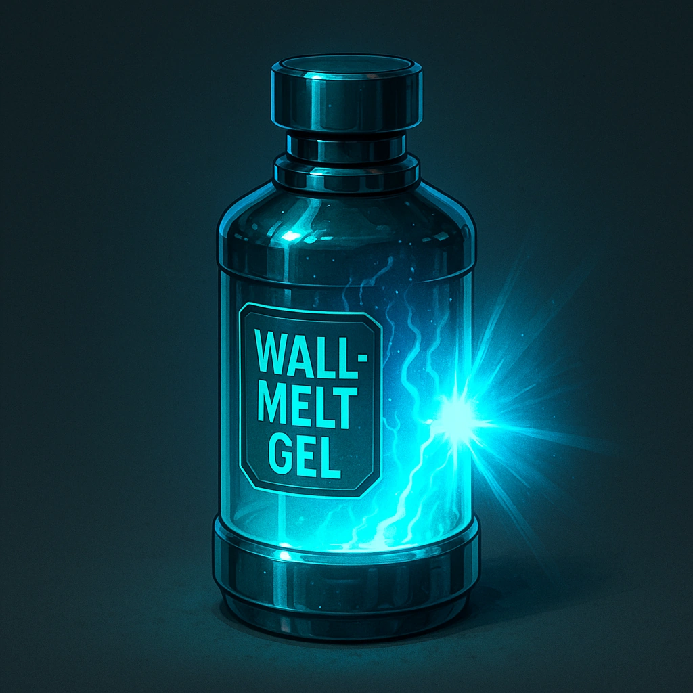

# Wall-Melt Gel

*An industrial solvent that dissolves barriers in bright flashes—stand clear.*

### **Tier: —**

#### Actions
- 
**Use** *This paste eats away walls and other surfaces in bright flashes.*

#### Effects
—

consumables
 
**UUID:** `Compendium.cybermancy.consumables.wall-melt-gel`

