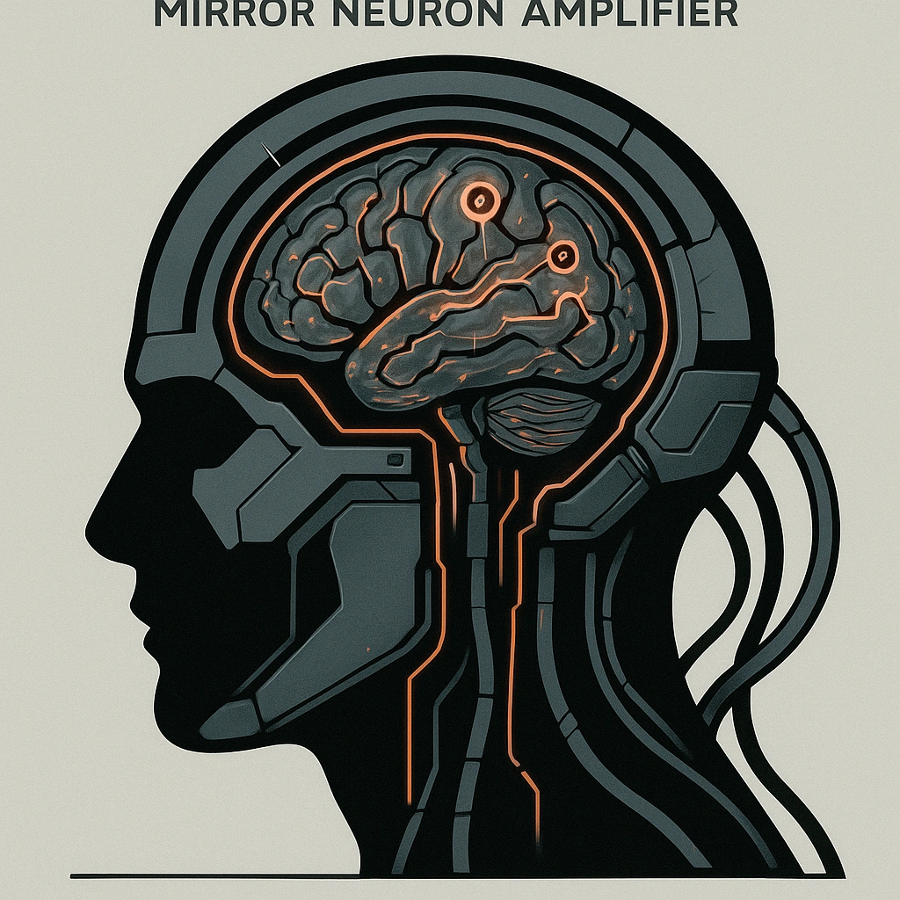

# Brainiac™ Mirror Neuron Amplifier

*<i>"Trade hope for unwavering charisma surge."</i>  
<strong>Spend 1 Hope</strong> to gain +2 on a Prescence Roll or Saving Throw
*

### **Tier: 3**

#### Actions
- 
**Brainiac™ Mirror Neuron Amplifier** *"Trade hope for unwavering charisma surge."Spend 1 Hope to gain +2 on a Prescence Roll or Saving Throw*

#### Effects
—

cybernetics/Tier 3
 
**UUID:** `Compendium.cybermancy.cybernetics.brainiac-mirror-neuron-amplifier`

