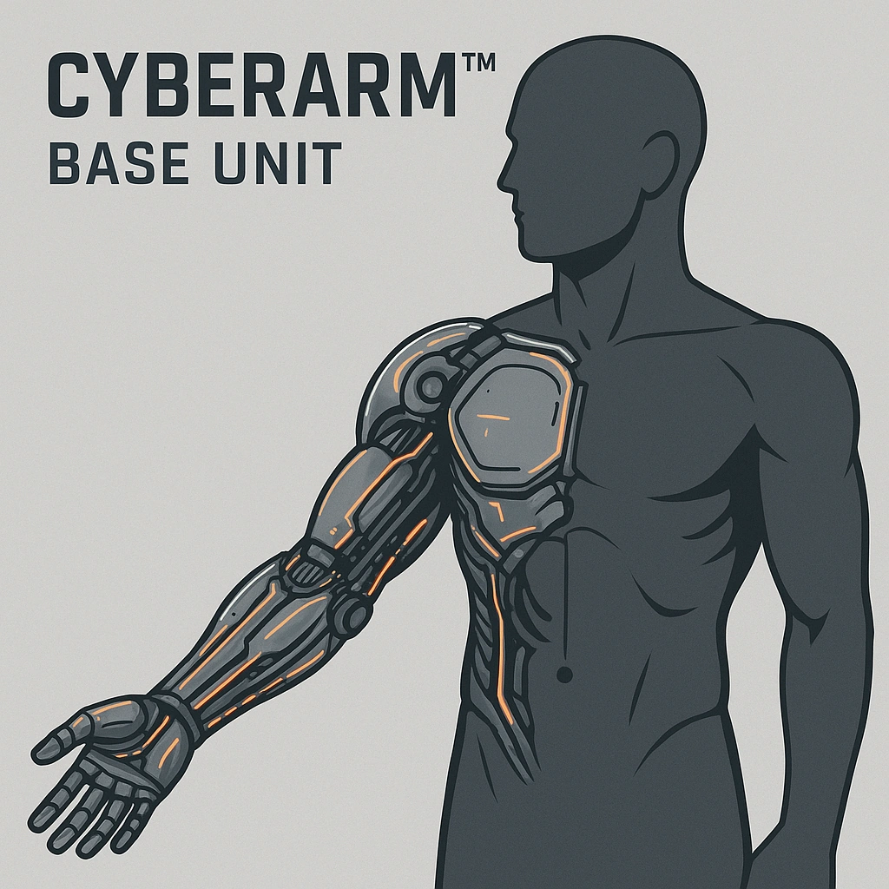

    

    

    
    ### Cyberarm™ Base Unit
    

    *&lt;i&gt;Unleash untamed might with mechanical grace.&lt;/i&gt;&lt;br /&gt;&lt;br /&gt;&lt;p class="Card-Feature"&gt;Cyberarm™ base unit - enables other Cyberarm-related cybernetics.  &lt;br /&gt;&lt;br /&gt; Once per long rest, &lt;strong&gt;Spend 1 Hope&lt;/strong&gt; for advantage on a Strength roll or saving throw&lt;/p&gt;*
    

    

    

    #### Actions
    - 
**Cyberarm™ Base Unit** *Unleash untamed might with mechanical grace.Cyberarm™ base unit - enables other Cyberarm-related cybernetics.   Once per long rest, Spend 1 Hope for advantage on a Strength roll or saving throw*

    #### Effects
    —
    

    

    

    **UUID:** `Compendium.cybermancy.cybernetics.cyberarm-base-unit`
    

    

    