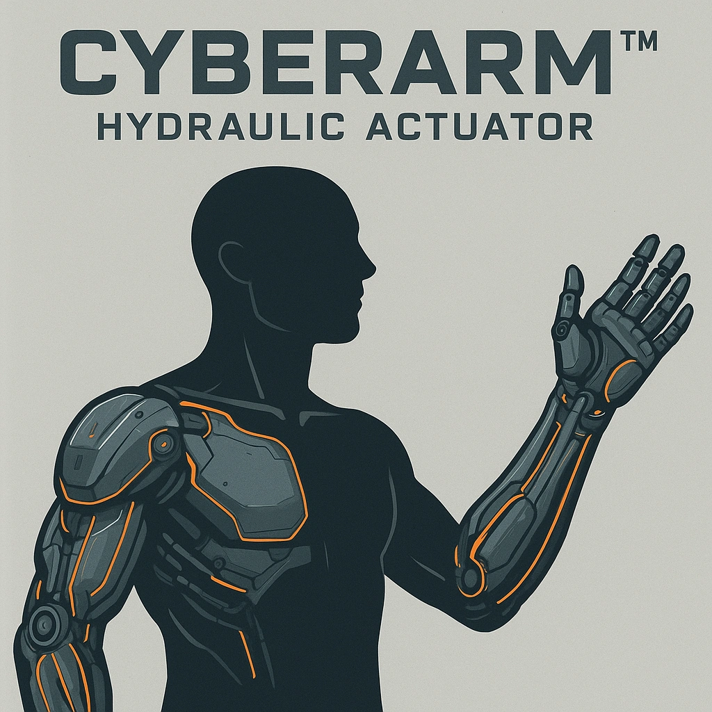

# Cyberarm™ Hydraulic Actuator

*<i>"Unleash your power, rest and rise."</i>  
Reduce the Cyberarm™ Strength effect's recovery time to once per rest.    <strong>Spend 1 Hope</strong> for advantage on a Strength roll or saving throw
*

### **Tier: 1**

#### Actions
- 
**Cyberarm™ Hydraulic Actuator** *"Unleash your power, rest and rise."Reduce the Cyberarm™ Strength effect's recovery time to once per rest.  Spend 1 Hope for advantage on a Strength roll or saving throw*

#### Effects
—

cybernetics/Tier 1
 
**UUID:** `Compendium.cybermancy.cybernetics.cyberarm-hydraulic-actuator`

