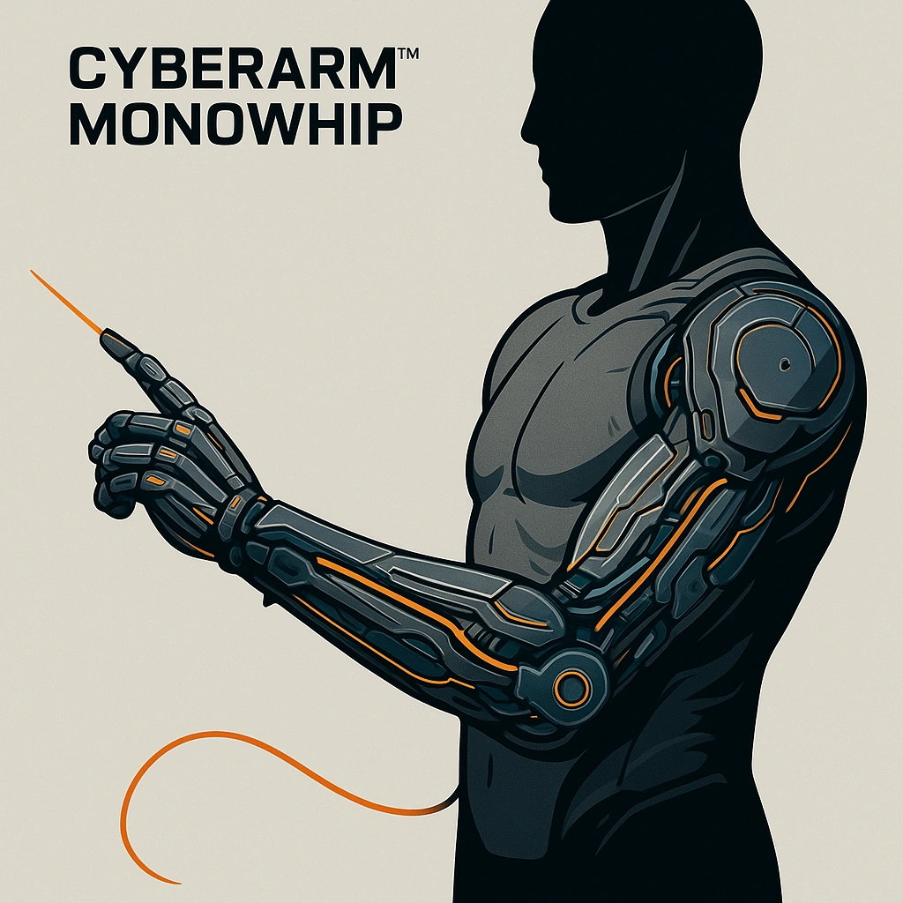

# Cyberarm™ Monowhip

*<i>"Unleash precision: slice worlds seamlessly."</i>  
Hidden fingertip spool that deploys a monomolecular whip.  Melee weapon, d8, with Lethal Edge and Slice in Two effects
*

### **Tier: Tier 1**

#### Actions
- 
**Cyberarm™ Monowhip** * slice worlds seamlessly."Hidden fingertip spool that deploys a monomolecular whip.  Melee weapon, d8, with Lethal Edge and Slice in Two effects*

- 
**Cyberarm™ Monowhip** * slice worlds seamlessly."Hidden fingertip spool that deploys a monomolecular whip.  Melee weapon, d8, with Lethal Edge and Slice in Two effects*

- 
**Lethal Edge** *On a Hope win, deal Severe damage if the Fear die shows 8-12.*

- 
**Critical Effect:  Slice in Two** *Sever or disable a limb, item, or piece of cover.*

#### Effects
—

cybernetics/Tier 1
 
**UUID:** `Compendium.cybermancy.cybernetics.cyberarm-monowhip`

