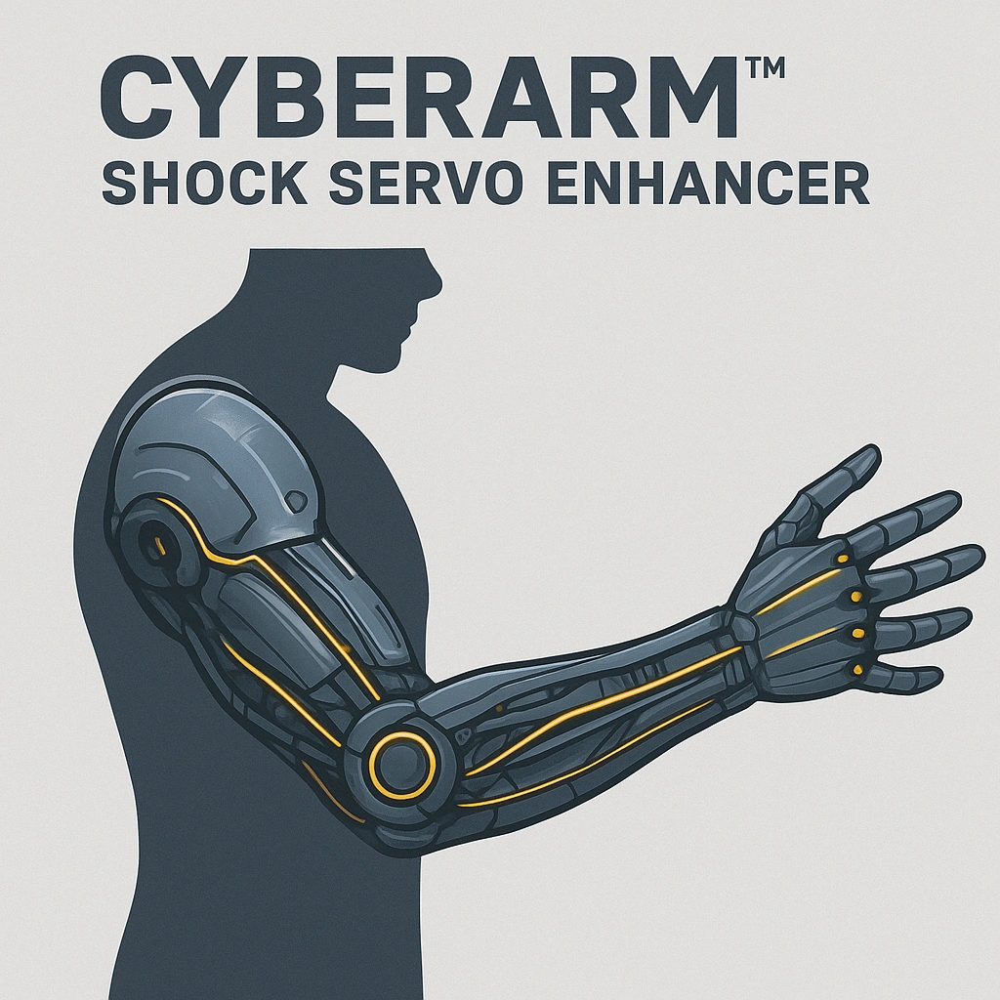

    

    

    
    ### Cyberarm™ Shock Servo Enhancer
    

    *&lt;i&gt;"Unleash silent fury, upgrade your strike."&lt;/i&gt;&lt;br /&gt;&lt;br /&gt;&lt;p class="Card-Feature"&gt;Once per scene, after making a successful Melee attack with a weapon that does physical damage, increase the damage die increment by 1 (e.g. d4 to d6).  &lt;br /&gt;&lt;br /&gt;Requires Cyberarm™ base unit&lt;/p&gt;*
    

    

    

    #### Actions
    - 
**Cyberarm™ Shock Servo Enhancer** *"Unleash silent fury, upgrade your strike."Once per scene, after making a successful Melee attack with a weapon that does physical damage, increase the damage die increment by 1 (e.g. d4 to d6).  Requires Cyberarm™ base unit*

    #### Effects
    —
    

    

    

    **UUID:** `Compendium.cybermancy.cybernetics.cyberarm-shock-servo-enhancer`
    

    

    