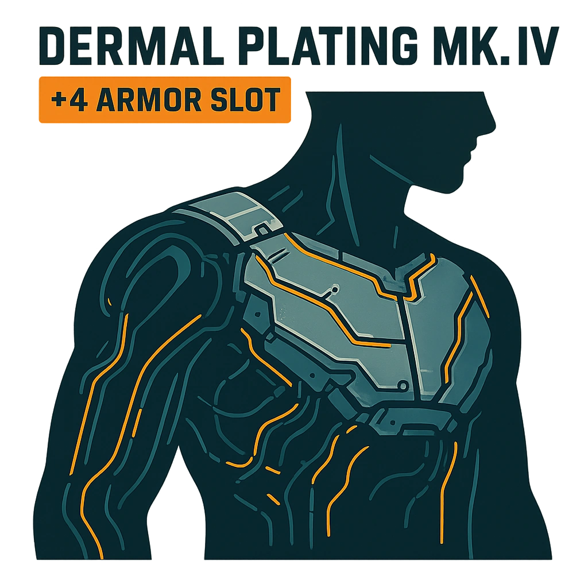

    

    

    
    ### Dermal Plating Mk.IV
    

    *&lt;i&gt;Unyielding shield, elegance beneath the skin.&lt;/i&gt;&lt;br /&gt;&lt;br /&gt;&lt;p class="Card-Feature"&gt;Gain +4 Armor Slot. You can only have 1 Dermal Plating enhancement, but they can be upgraded.&lt;/p&gt;*
    

    

    

    #### Actions
    - 
**Unnamed Action** **

    #### Effects
    —
    

    

    

    **UUID:** `Compendium.cybermancy.cybernetics.dermal-plating-mk-iv`
    

    

    