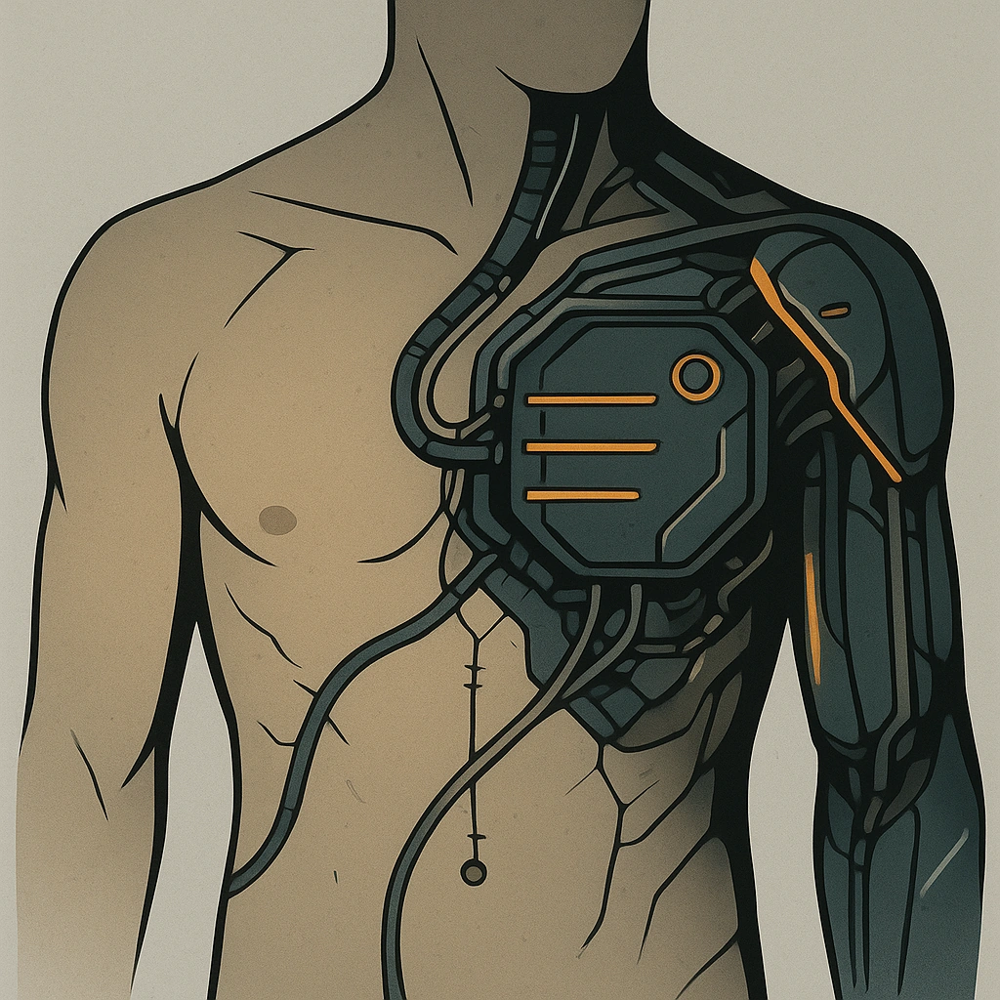

    

    

    
    ### Dynamic tattoo
    

    *&lt;i&gt;"Radiate power; command with a glance."&lt;/i&gt;&lt;br /&gt;&lt;br /&gt;&lt;p class="Card-Feature"&gt;&lt;strong&gt;Spend 1 Hope&lt;/strong&gt; to gain +1 on a Presence roll, so long as the target can see your skin&lt;/p&gt;*
    

    

    

    #### Actions
    - 
**Dynamic tattoo** *"Radiate power; command with a glance."Spend 1 Hope to gain +1 on a Presence roll, so long as the target can see your skin*

    #### Effects
    —
    

    

    

    **UUID:** `Compendium.cybermancy.cybernetics.dynamic-tattoo`
    

    

    