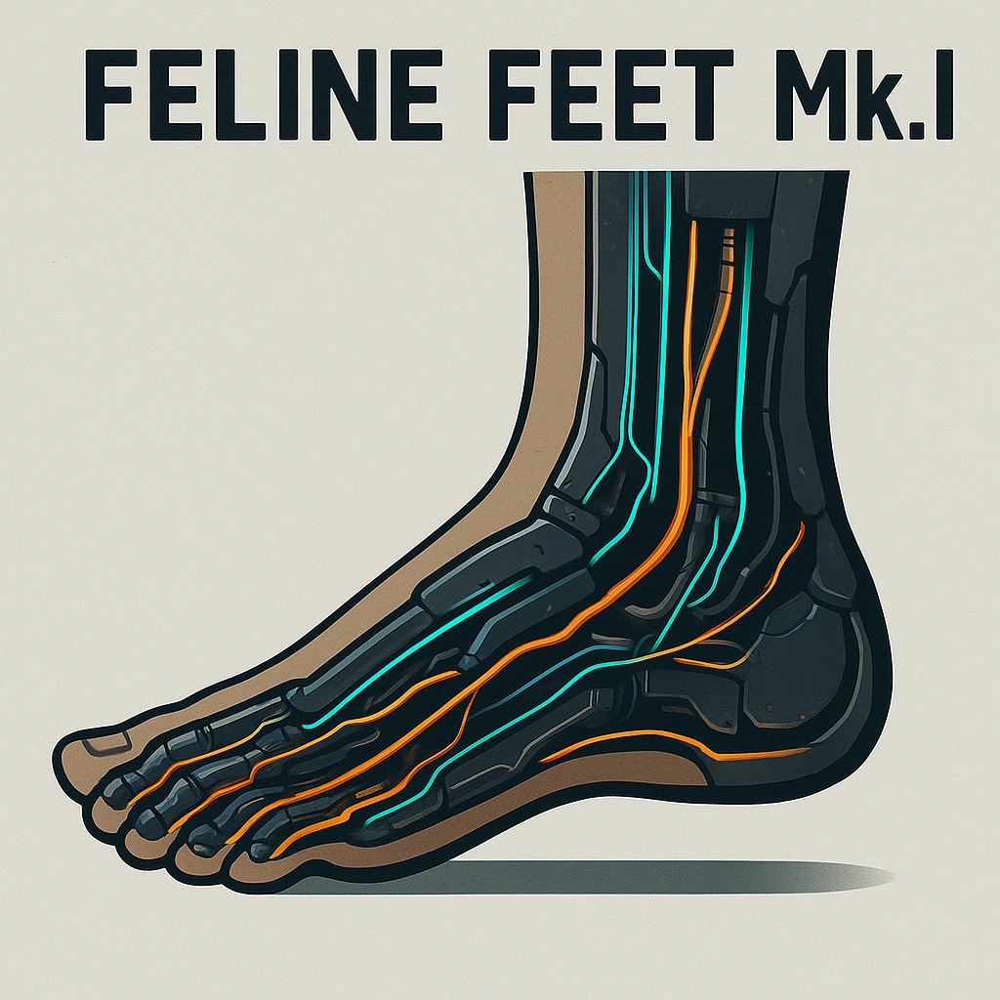

# Feline Feet Mk.I

*<i>Leap beyond limits with feline finesse.</i>  
Before rolling an Agility check for an action or reaction, <strong>Spend 1 Hope</strong> to gain +2 on that roll. You can only have 1 Feline Feet enhancement, but they can be upgraded.
*

### **Tier: Tier 1**

#### Actions
- 
**Unnamed Action** **

#### Effects
—

cybernetics/Tier 1
 
**UUID:** `Compendium.cybermancy.cybernetics.feline-feet-mk-i`

