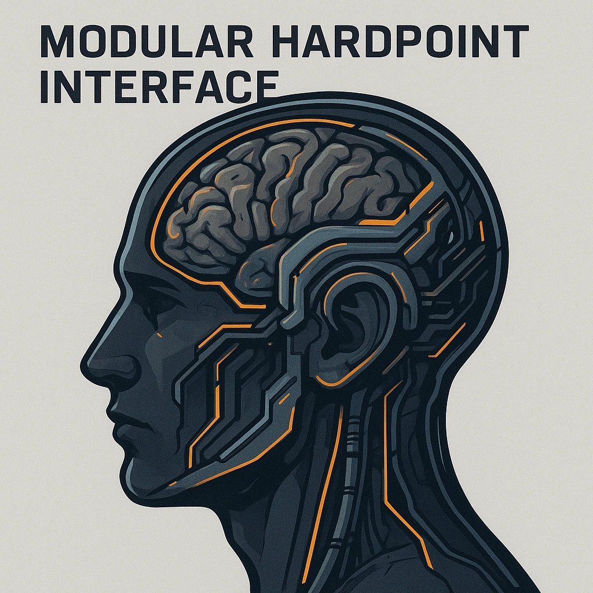

    

    

    
    ### Modular Hardpoint Interface
    

    *&lt;i&gt;"Enhance potential, expand your digital domain."&lt;/i&gt;&lt;br /&gt;&lt;br /&gt;&lt;p class="Card-Feature"&gt;Increase the number of Domain Cards in your load out by 1 permenantly.&lt;/p&gt;*
    

    

    

    #### Actions
    —

    #### Effects
    —
    

    

    

    **UUID:** `Compendium.cybermancy.cybernetics.modular-hardpoint-interface`
    

    

    