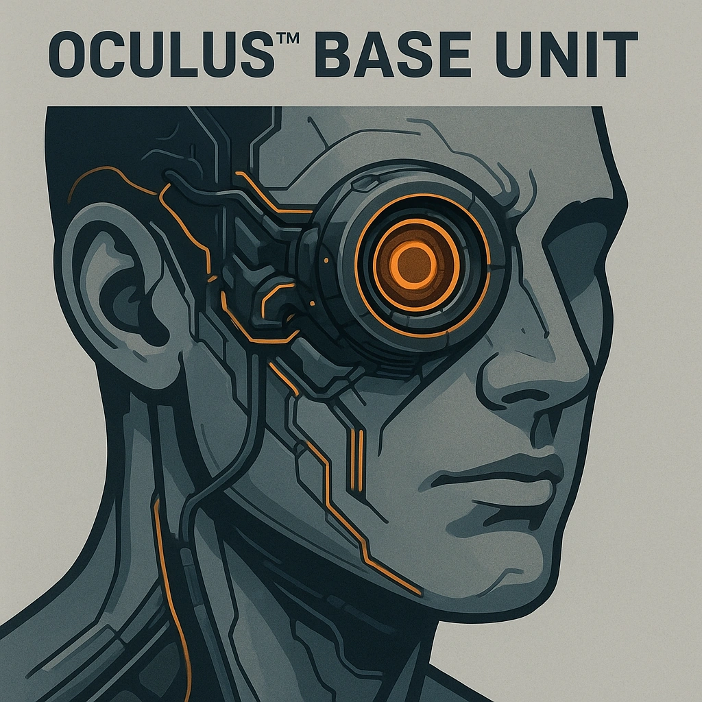

# Oculus™ Base Unit

*<i>"See, capture, upgrade—vision redefined."</i>  
Your eyes have been replaced with Oculus™ granting the ability to photograph and video record.  This base unit is required for several upgrades.
*

### **Tier: 1**

#### Actions
- 
**Oculus™ Base Unit** *"See, capture, upgrade—vision redefined."Your eyes have been replaced with Oculus™ granting the ability to photograph and video record.  This base unit is required for several upgrades.*

#### Effects
—

cybernetics/Tier 1
 
**UUID:** `Compendium.cybermancy.cybernetics.oculus-base-unit`

