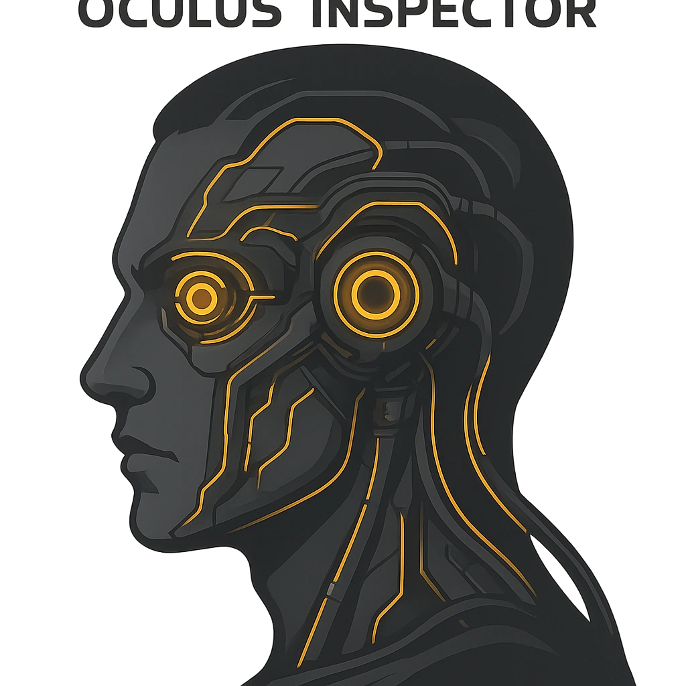

# Oculus™ Inspecter

*<i>"Eyes unveil secrets, but Hope pays."</i>  
<strong>Spend 1 Hope</strong> to gain +2 on a Sense roll so long as you can see the creature's face and eyes.
*

### **Tier: 2**

#### Actions
- 
**Oculus™ Inspecter** *"Eyes unveil secrets, but Hope pays."Spend 1 Hope to gain +2 on a Sense roll so long as you can see the creature's face and eyes.*

#### Effects
—

cybernetics/Tier 2
 
**UUID:** `Compendium.cybermancy.cybernetics.oculus-inspecter`

