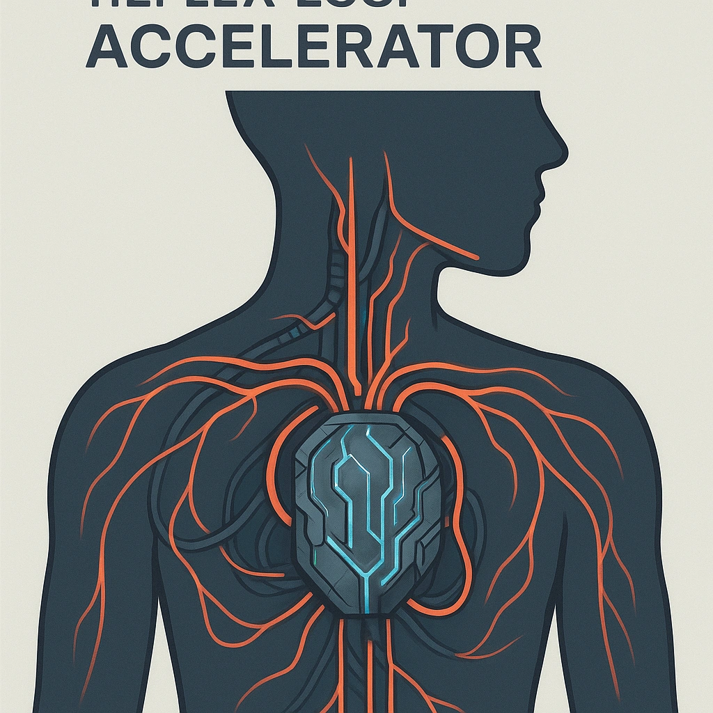

# Reflex Loop Accelerator

*<i>Unleash potential, where stress births success.</i>  
Once per rest, <strong>Mark 1 Stress</strong> to make your Hope die a d20 for 1 attack roll
*

### **Tier: 3**

#### Actions
- 
**Reflex Loop Accelerator** *Unleash potential, where stress births success.Once per rest, Mark 1 Stress to make your Hope die a d20 for 1 attack roll*

#### Effects
—

cybernetics/Tier 3
 
**UUID:** `Compendium.cybermancy.cybernetics.reflex-loop-accelerator`

