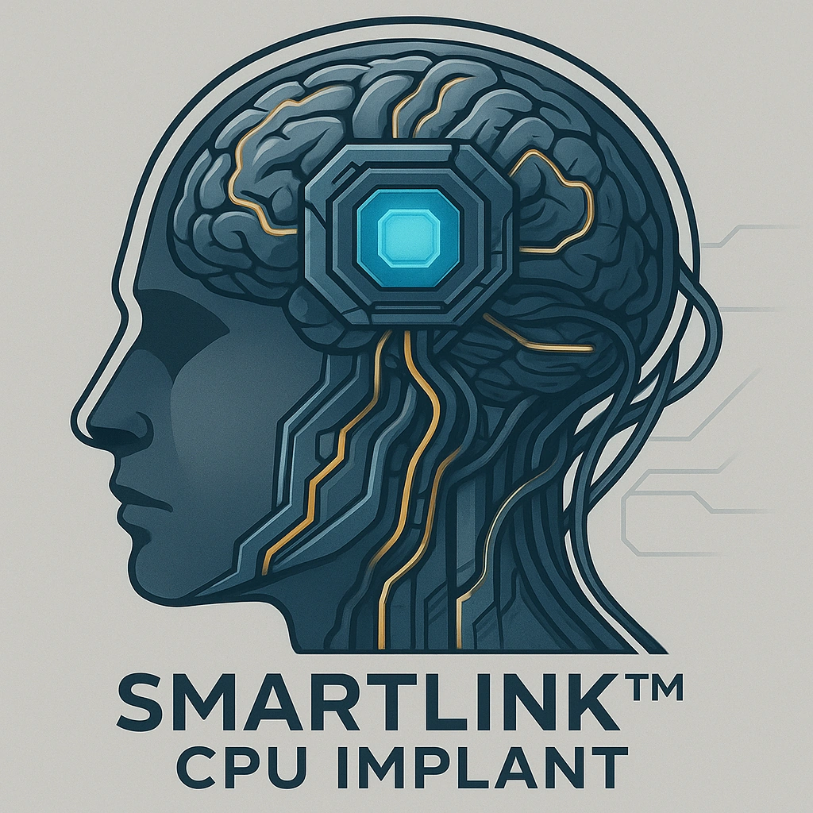

# SmartLink™ CPU Implant

*
<em>"Awaken instinct with SmartLink's synergy."</em>  

SmarkLink™ base unit - enables other SmartLink-related weapons and abilities.   Once per long rest, <strong>Spend 1 Hope</strong> for advantage on an Instinct roll or saving throw.
*

### **Tier: Tier 1**

#### Actions
- 
**SmartLink™ CPU Implant** *"Awaken instinct with SmartLink's synergy."

SmarkLink™ base unit - enables other SmartLink-related weapons and abilities. 

Once per long rest, Spend 1 Hope for advantage on an Instinct roll or saving throw.*

#### Effects
—

cybernetics/Tier 1
 
**UUID:** `Compendium.cybermancy.cybernetics.smartlink-cpu-implant`

