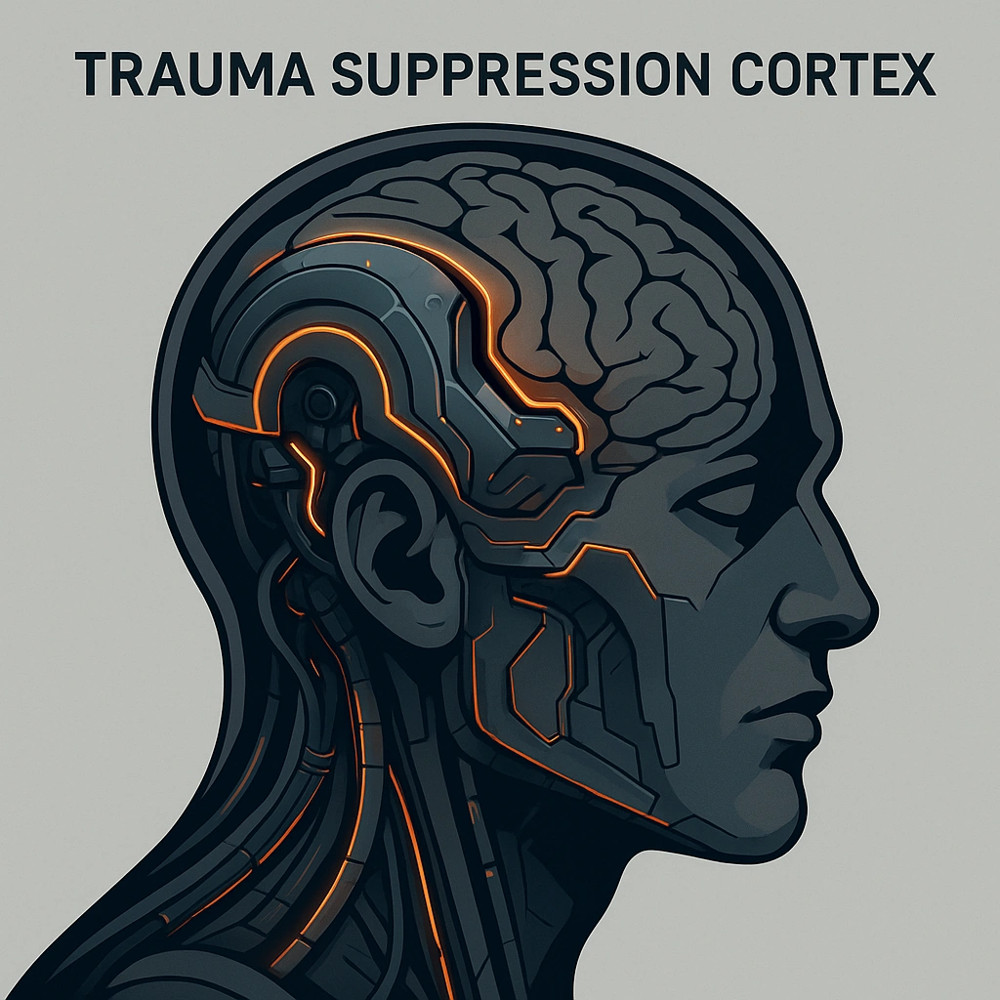

# Trauma Suppression Cortex

*<i>Hope's Shield: Defy damage, embrace resilience.</i>  
Once per scene, <strong>Spend 3 Hope</strong> to prevent Marking up to 3 Stress caused by damage from an external source (cannot be used to prevent Marking Stress from an action or reaction of your choice)
*

### **Tier: Tier 3**

#### Actions
- 
**Trauma Suppression Cortex** * Defy damage, embrace resilience.Once per scene, Spend 3 Hope to prevent Marking up to 3 Stress caused by damage from an external source (cannot be used to prevent Marking Stress from an action or reaction of your choice)*

#### Effects
—

cybernetics/Tier 3
 
**UUID:** `Compendium.cybermancy.cybernetics.trauma-suppression-cortex`

