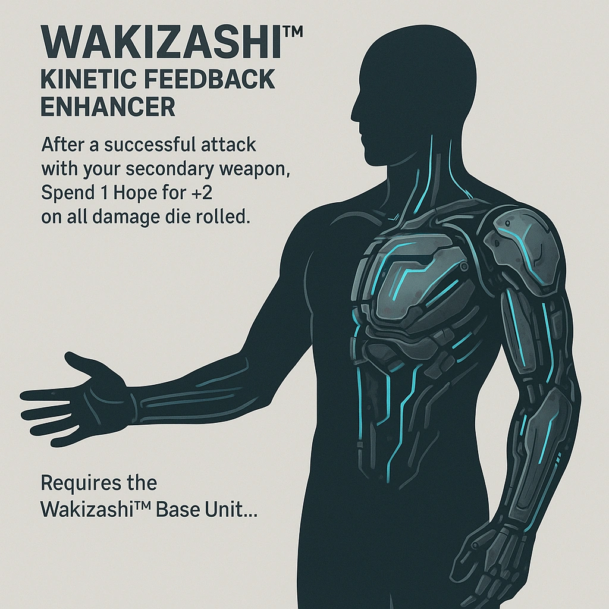

    

    

    
    ### Wakizashi™ Kinetic Feedback Enhancer
    

    *&lt;i&gt;Hope-fueled fury, precision scars victory.&lt;/i&gt;&lt;br /&gt;&lt;br /&gt;&lt;p class="Card-Feature"&gt;After a successful attack with your secondary weapon, &lt;strong&gt;Spend 1 Hope&lt;/strong&gt; for +2 on all damage die rolled. &lt;br /&gt;&lt;br /&gt;Requires the Wakizashi™ Base Unit.&lt;/p&gt;*
    

    

    

    #### Actions
    - 
**Wakizashi™ Kinetic Feedback Enhancer** *Hope-fueled fury, precision scars victory.After a successful attack with your secondary weapon, Spend 1 Hope for +2 on all damage die rolled. Requires the Wakizashi™ Base Unit.*

    #### Effects
    —
    

    

    

    **UUID:** `Compendium.cybermancy.cybernetics.wakizashi-kinetic-feedback-enhancer`
    

    

    