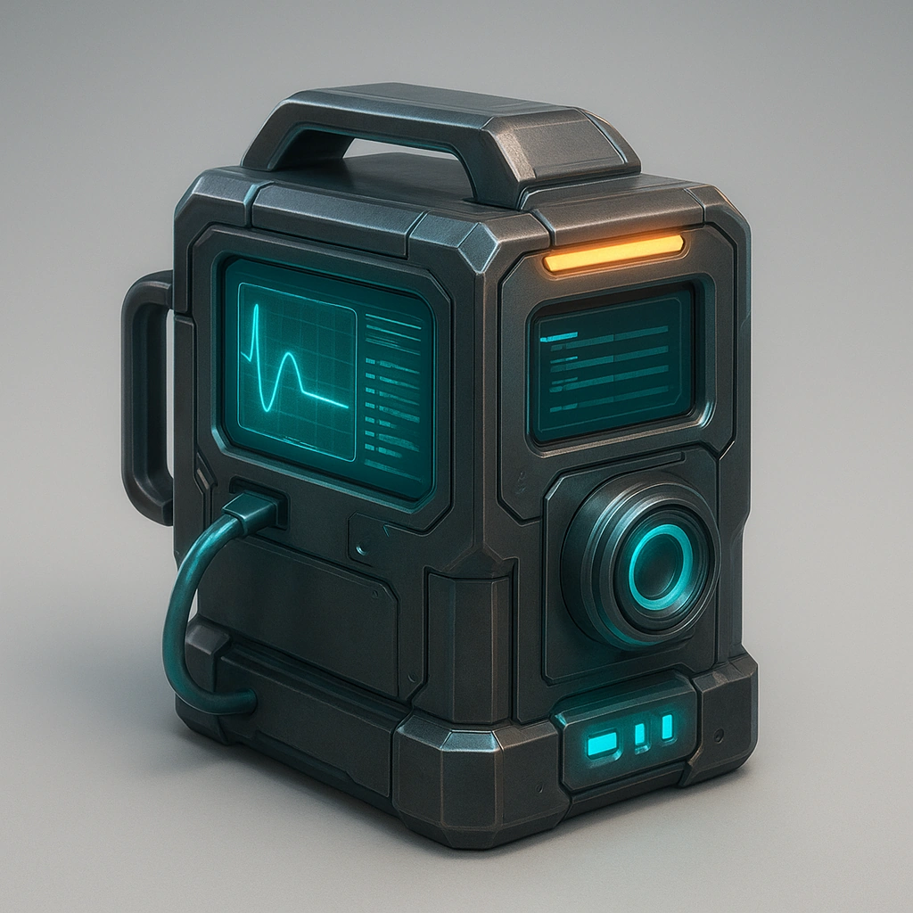

# Chemical analysis tool

*Your Primary Drone gains the ability to constantly monitor environment within Close for any chemical hazards and can detect explosives as well.*

### **Tier: Tier 1**

#### Actions
—

#### Effects
—

drones-devices/Tier 1
 
**UUID:** `Compendium.cybermancy.drones-devices.chemical-analysis-tool`

