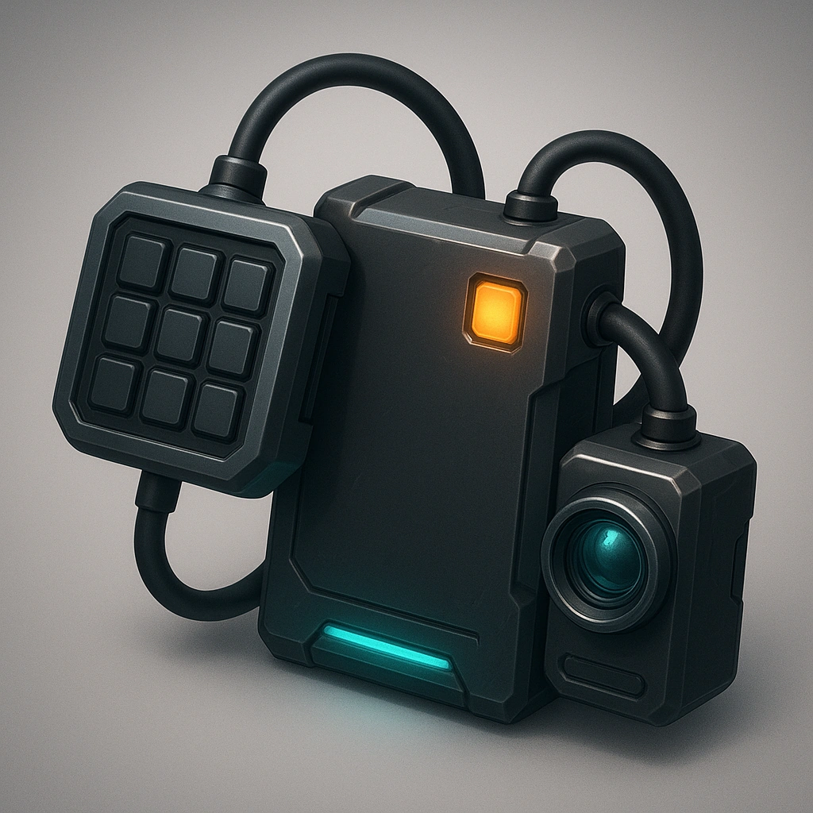

# Electronic surveillance kit

*Give your Primary Drone the ability to eavesdrop on electric signals within Very Far.  If those signals are encrypted, you must make a Knowledge check against the Environment Difficulty to decrypt.*

### **Tier: Tier 1**

#### Actions
—

#### Effects
—

drones-devices/Tier 1
 
**UUID:** `Compendium.cybermancy.drones-devices.electronic-surveillance-kit`

