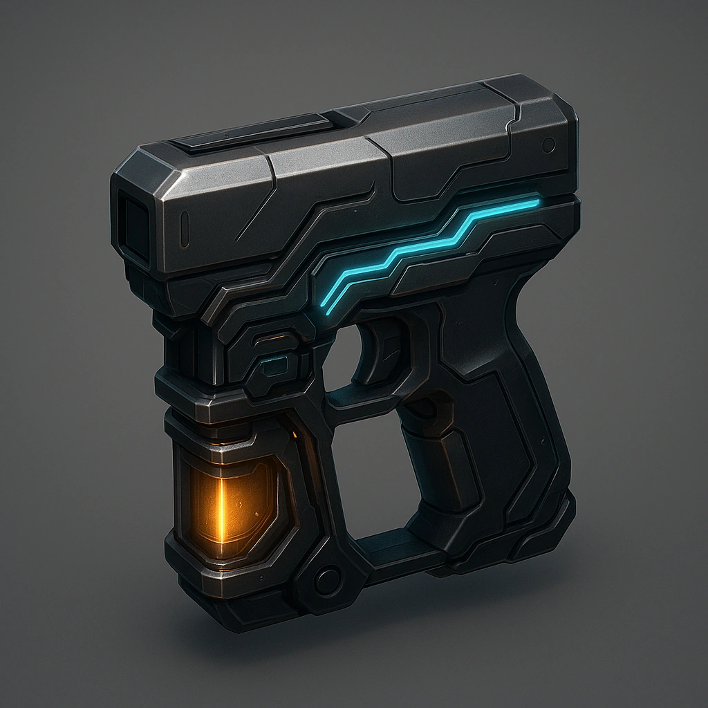

# Extra weapon

*Your Primary Drone gains an extra attack, d6+2*

### **Tier: Tier 2**

#### Actions
—

#### Effects
—

drones-devices/Tier 2
 
**UUID:** `Compendium.cybermancy.drones-devices.extra-weapon`

