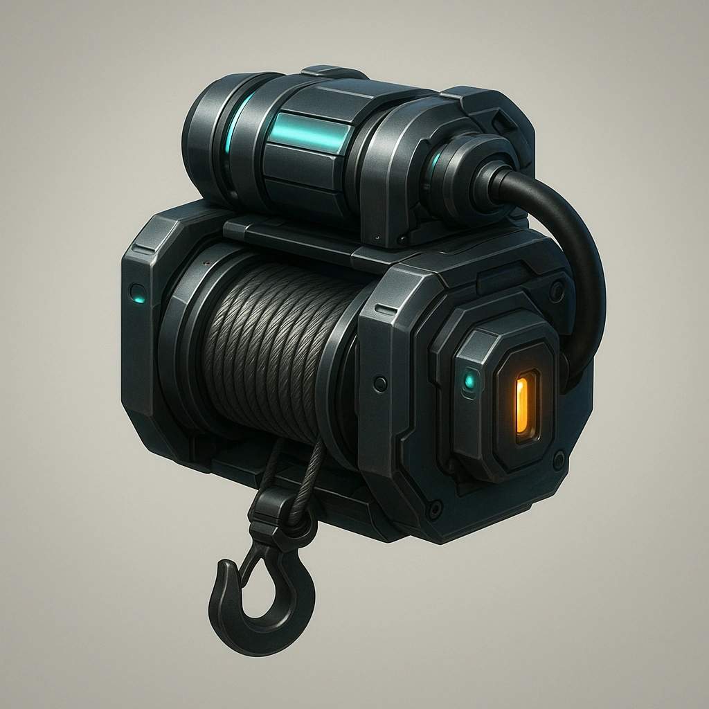

# Grappling device

*Your Primary Drone has an embedded grappling hook and 10m of cable.*

### **Tier: Tier 1**

#### Actions
—

#### Effects
—

drones-devices/Tier 1
 
**UUID:** `Compendium.cybermancy.drones-devices.grappling-device`

