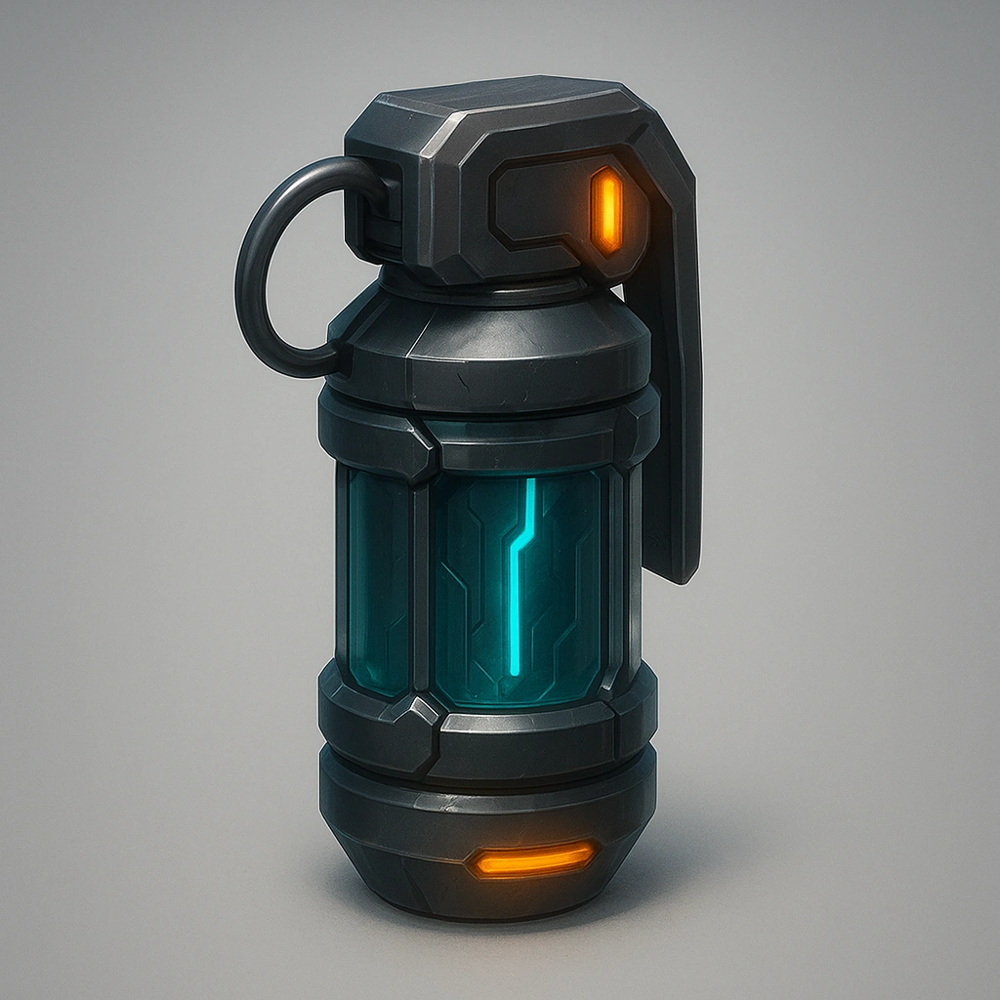

# Grenade

*Place a token on this card and remove 1 grenade from your inventory.  Your Primary Drone now has the ability to launch that grenade as an attack action .*

### **Tier: Tier 2**

#### Actions
—

#### Effects
—

drones-devices/Tier 2
 
**UUID:** `Compendium.cybermancy.drones-devices.grenade`

