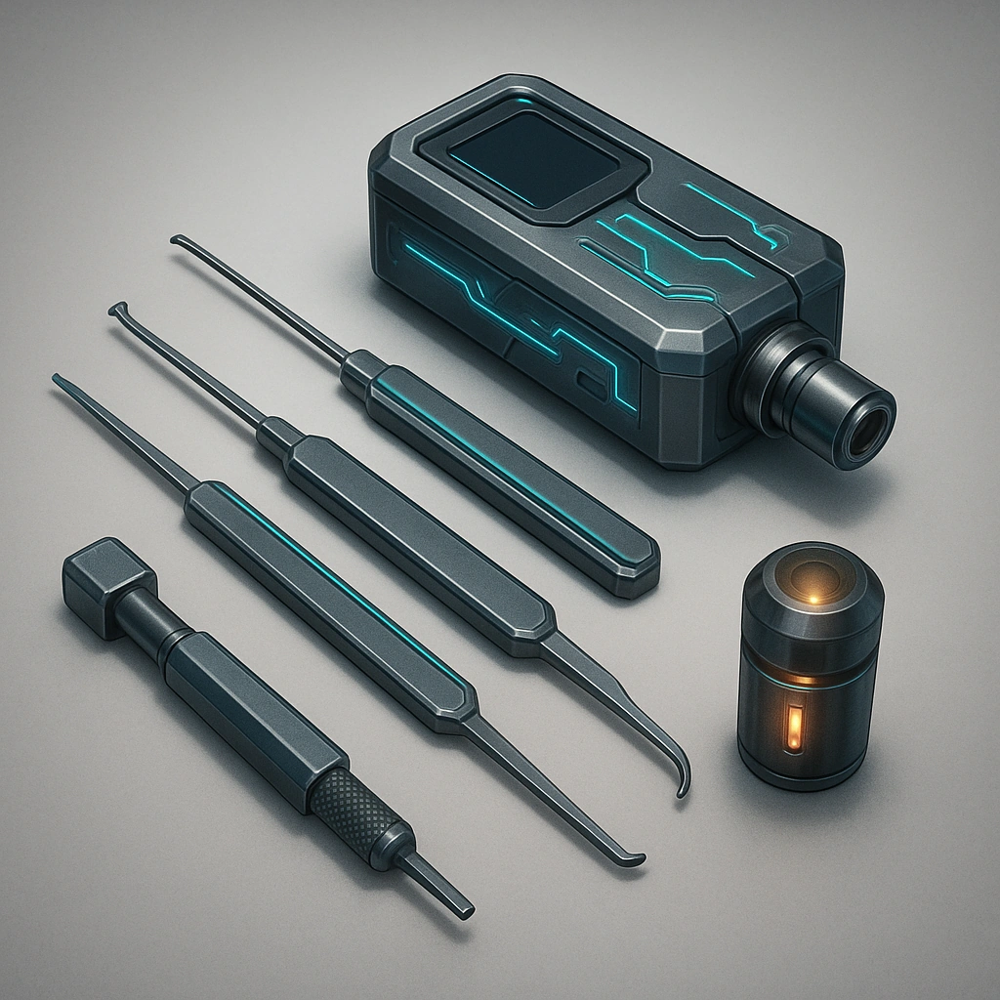

# Lock kit

*Give your Primary Drone the ability to make a Finesse check using your character's Finesse ability when attempting to open a physical or electronic lock.*

### **Tier: Tier 2**

#### Actions
—

#### Effects
—

drones-devices/Tier 2
 
**UUID:** `Compendium.cybermancy.drones-devices.lock-kit`

