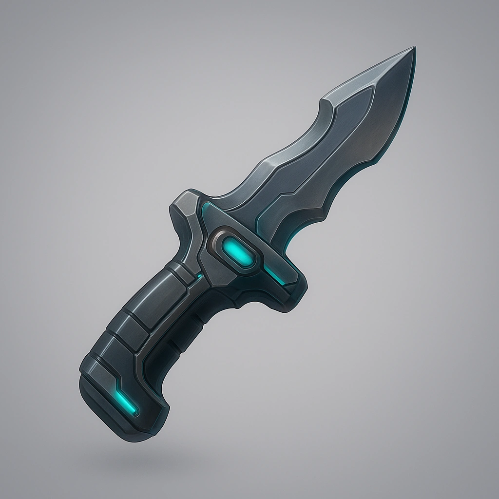

# Melee weapon

*Your drone gains an extra Melee range attack, damage: d8+3*

### **Tier: Tier 1**

#### Actions
—

#### Effects
—

drones-devices/Tier 1
 
**UUID:** `Compendium.cybermancy.drones-devices.melee-weapon`

