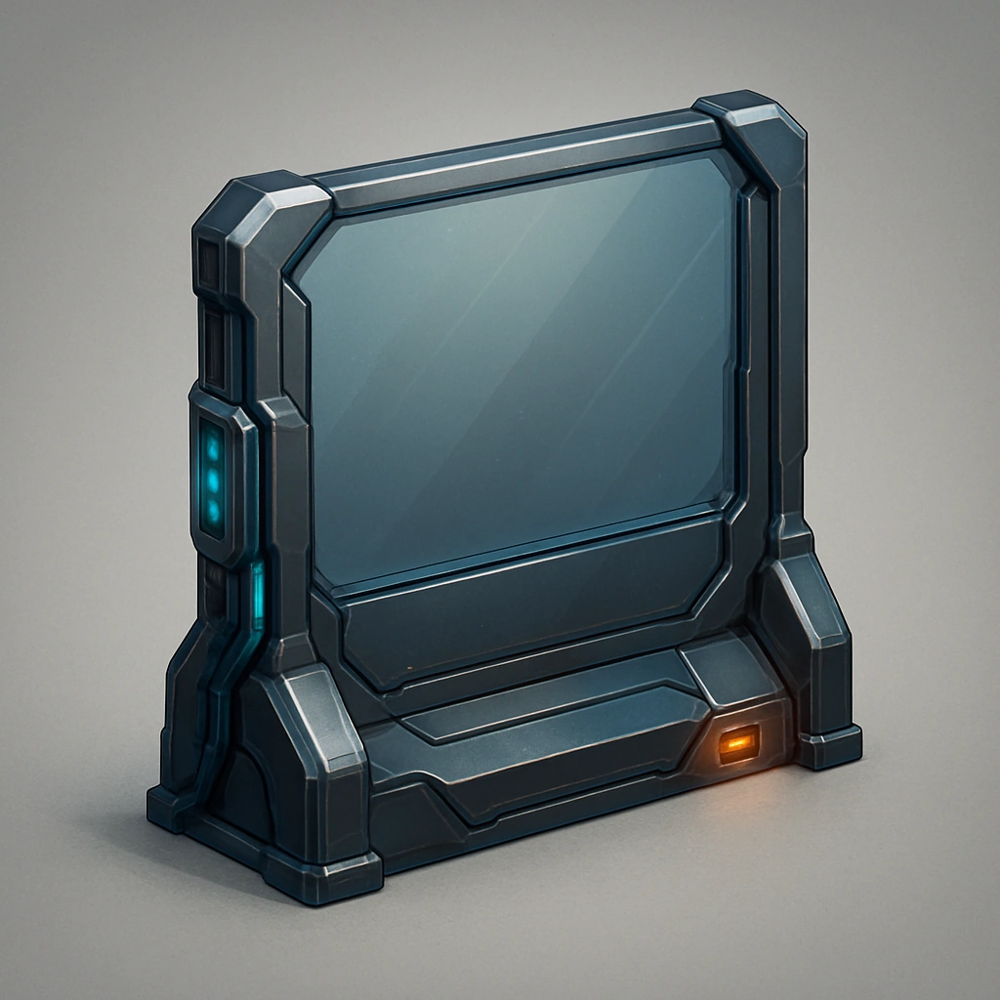

# Portable barrier

*Your Primary Drone gains the ability to deploy a linear barrier.  Any creature can gain the Hidden condition by crouching down behind the barrier, but the drone may now gain the Hidden condition from its own portable barrier.*

### **Tier: Tier 2**

#### Actions
—

#### Effects
—

drones-devices/Tier 2
 
**UUID:** `Compendium.cybermancy.drones-devices.portable-barrier`

